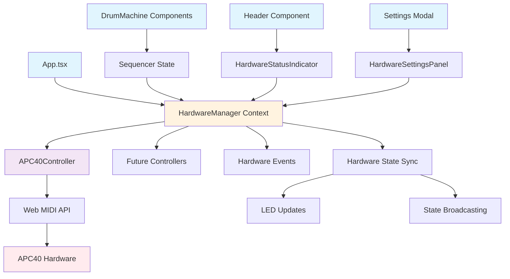

# Centaurus Drum Machine - APC40 Hardware Controller Integration Architecture

**⚠️ HISTORICAL DOCUMENT**

This document represents the original comprehensive architecture for Epic 1 (APC40 Hardware Controller Integration) created on 2025-09-25. It has been superseded by more structured documentation:

**Current Architecture:** See [`docs/architecture/`](./architecture/)
- [Architecture Index](./architecture/index.md) - Architecture overview
- [Tech Stack](./architecture/tech-stack.md) - Technology stack details
- [Component Architecture](./architecture/component-architecture.md) - Component structure
- [Source Tree](./architecture/source-tree.md) - File organization

**Epic 1 Details:** See [`docs/epics/epic-1-apc40-hardware-controller-integration.md`](./epics/epic-1-apc40-hardware-controller-integration.md)

This document is preserved for historical reference and contains valuable context from initial planning, including the hardware abstraction layer design and Web MIDI API integration patterns.

---

**Version**: 1.0
**Date**: 2025-09-25
**Architect**: Winston (BMad Architect Agent)

## Introduction

This document outlines the architectural approach for enhancing **Centaurus Drum Machine** with **APC40 MIDI hardware controller integration with real-time LED feedback and modular hardware abstraction layer**. Its primary goal is to serve as the guiding architectural blueprint for AI-driven development of new features while ensuring seamless integration with the existing system.

**Relationship to Existing Architecture:**  
This document supplements existing project architecture by defining how new hardware abstraction components will integrate with the current React/TypeScript/Tone.js system. Where conflicts arise between new and existing patterns, this document provides guidance on maintaining consistency while implementing the hardware controller enhancement.

### Existing Project Analysis

**Current Project State**:
- **Primary Purpose**: Web-based drum sequencer with educational features and visual feedback
- **Current Tech Stack**: React 18.2.0 + TypeScript, Vite build tool, Tone.js 15.1.22 audio engine, Tailwind CSS design system
- **Architecture Style**: Component-based React architecture with singleton audio engine pattern, event-driven audio scheduling
- **Deployment Method**: Static web application built with Vite, no server-side dependencies

**Available Documentation**:
- TypeScript interfaces defined in `src/types/index.ts`
- Component architecture evident from organized folder structure
- Audio engine singleton pattern in `src/utils/audioEngine.ts`
- Color mapping system for visual feedback
- Educational mode implementation demonstrating extensible architecture

**Identified Constraints**:
- Browser-only deployment (no server infrastructure)
- Tone.js timing precision requirements for audio synchronization
- React state management patterns must be maintained
- Mobile responsiveness requirements (existing Tailwind implementation)
- No existing external API dependencies (purely client-side application)

### Change Log

| Change | Date | Version | Description | Author |
|--------|------|---------|-------------|---------|
| Initial Architecture Creation | 2025-09-25 | 1.0 | Created comprehensive architecture for APC40 hardware integration | Winston (BMad Architect Agent) |

## Enhancement Scope and Integration Strategy

### Enhancement Overview

**Enhancement Type**: Hardware Integration with Modular Architecture  
**Scope**: Add APC40 MIDI controller support through new hardware abstraction layer while maintaining complete separation from existing drum sequencer core  
**Integration Impact**: Moderate - New module addition with event-based communication, no modifications to existing components

### Integration Approach

**Code Integration Strategy**: **Additive Architecture Pattern**
- Create new `src/hardware/` module tree completely separate from existing components
- Use React's existing event system and context patterns for communication
- Maintain existing component interfaces without modification
- Follow established TypeScript patterns and folder organization

**Database Integration**: **No Database Changes Required**  
- All hardware state managed in React component state and localStorage
- Follows existing pattern of client-side state management
- Hardware settings persist using same localStorage patterns as current app settings

**API Integration**: **Event-Driven Communication**
- Hardware modules communicate with drum sequencer through React's existing event system
- No new HTTP APIs - maintains current client-only architecture  
- Web MIDI API integration handled within hardware abstraction layer

**UI Integration**: **Component Composition Pattern**
- Hardware UI components follow existing Tailwind component patterns
- Hardware status integrated into existing layouts through composition
- Settings panel extends existing modal/settings architecture
- Maintains responsive behavior through existing Tailwind breakpoint system

### Compatibility Requirements

- **Existing API Compatibility**: All current component props, interfaces, and exports remain unchanged
- **Database Schema Compatibility**: No schema changes (no database in current architecture)  
- **UI/UX Consistency**: Hardware UI follows existing Tailwind design tokens, spacing, and interaction patterns
- **Performance Impact**: Hardware layer operates independently with <5% performance overhead on existing functionality

## Tech Stack

### Existing Technology Stack

| Category | Current Technology | Version | Usage in Enhancement | Notes |
|----------|-------------------|---------|---------------------|--------|
| **Frontend Framework** | React | 18.2.0 | Core UI framework for hardware components | Maintained, no changes |
| **Language** | TypeScript | 5.2.2 | All new hardware modules | Strict mode compliance |
| **Build Tool** | Vite | 5.0.8 | Build pipeline for hardware modules | No additional config needed |
| **Styling** | Tailwind CSS | 3.3.6 | Hardware UI component styling | Existing design tokens |
| **Audio Engine** | Tone.js | 15.1.22 | Timing synchronization for LED updates | Extends existing scheduler |
| **Icons** | Lucide React | 0.294.0 | Hardware status icons | Consistent icon system |
| **State Management** | React useState/Context | 18.2.0 | Hardware module state | Follows existing patterns |

### New Technology Additions

| Technology | Version | Purpose | Rationale | Integration Method |
|------------|---------|---------|-----------|-------------------|
| **Web MIDI API** | Native Browser API | MIDI device communication | Only browser-native API for MIDI hardware | Direct browser API calls |
| **Performance.now()** | Native Browser API | High-precision timing | Required for LED synchronization accuracy | Extends existing Tone.js timing |

**Technology Selection Rationale**: No external dependencies added. Enhancement uses only browser-native APIs (Web MIDI, Performance) that integrate cleanly with existing Tone.js timing system. This maintains the project's philosophy of minimal external dependencies while enabling professional hardware integration.

## Data Models and Schema Changes

### New Data Models

#### HardwareController
**Purpose**: Abstract base interface for all hardware controllers  
**Integration**: Defines contract that APC40 and future controllers implement

**Key Attributes**:
- `id: string` - Unique identifier for controller instance
- `name: string` - Human-readable controller name  
- `connectionStatus: 'connected' | 'disconnected' | 'error'` - Real-time connection state
- `capabilities: ControllerCapabilities` - Features supported by this controller

**Relationships**:
- **With Existing**: Subscribes to existing sequencer state via React context
- **With New**: Base interface implemented by APC40Controller and future controllers

#### APC40Controller
**Purpose**: APC40-specific implementation with LED control and MIDI mapping  
**Integration**: Implements HardwareController interface with APC40-specific features

**Key Attributes**:
- `midiInput: WebMIDI.MIDIInput | null` - Web MIDI API input connection
- `midiOutput: WebMIDI.MIDIOutput | null` - Web MIDI API output connection  
- `ledStates: Map<number, number>` - Current LED state cache for optimization
- `gridMapping: GridMapping` - APC40 8x5 grid to 16-step sequencer mapping

**Relationships**:
- **With Existing**: Listens to DrumTrack state changes, integrates with existing audio timing
- **With New**: Managed by HardwareManager, communicates with other controllers through events

#### HardwareEvent
**Purpose**: Standardized event system for hardware ↔ sequencer communication  
**Integration**: Uses React's existing event patterns and context system

**Key Attributes**:
- `type: 'step_toggle' | 'connection_change' | 'hardware_input'` - Event classification
- `controllerId: string` - Source controller identifier
- `data: Record<string, unknown>` - Type-safe event payload
- `timestamp: number` - High-precision event timing

**Relationships**:
- **With Existing**: Integrates with existing React event handling and state management
- **With New**: Core communication mechanism between all hardware modules

### Schema Integration Strategy

**Database Changes Required**: None - all hardware state managed in React component state and localStorage

**Storage Strategy**:
- **Runtime State**: React useState/useContext for active hardware connections and real-time state
- **Persistent Settings**: localStorage for hardware preferences (LED brightness, color modes, device pairing)
- **Session State**: All hardware state cleared on app reload, following existing pattern

**Backward Compatibility**: Complete - no database schema exists, all new state management follows existing client-side patterns

## Component Architecture

### New Components

#### HardwareManager
**Responsibility**: Central orchestrator for all hardware controller lifecycle management and coordination  
**Integration Points**: React context provider wrapping existing App component, subscribes to sequencer state changes

**Key Interfaces**:
- `useHardware()` - React hook for accessing hardware state and control functions
- `registerController(controller)` - Plugin system for adding new hardware types
- `broadcastSequencerState(state)` - Distributes sequencer changes to all connected hardware

**Dependencies**:
- **Existing Components**: Subscribes to existing sequencer context/state
- **New Components**: Manages APC40Controller and future controller instances

**Technology Stack**: React Context API, TypeScript interfaces, Web MIDI API integration

#### APC40Controller
**Responsibility**: APC40-specific MIDI communication, LED control, and device state management  
**Integration Points**: Implements HardwareController interface, managed by HardwareManager

**Key Interfaces**:
- `connect()` - Establish MIDI connection and device initialization
- `updateLEDs(sequencerState)` - Translate sequencer state to LED patterns
- `handleMIDIInput(event)` - Process hardware button presses and forward to sequencer

**Dependencies**:
- **Existing Components**: None (complete isolation from existing components)
- **New Components**: Communicates through HardwareManager event system

**Technology Stack**: Web MIDI API, APC40-specific MIDI implementation, LED color mapping

#### HardwareStatusIndicator
**Responsibility**: Visual feedback for hardware connection status and device information  
**Integration Points**: Composes into existing Header component through props, follows Tailwind design patterns

**Key Interfaces**:
- `connectionStatus` - Display current hardware connection state
- `deviceInfo` - Show connected device details
- `onClick` - Navigate to hardware settings modal

**Dependencies**:
- **Existing Components**: Uses existing Lucide icons, follows Header component patterns
- **New Components**: Receives state from HardwareManager context

**Technology Stack**: React functional component, Tailwind CSS, Lucide React icons

#### HardwareSettingsPanel
**Responsibility**: Hardware configuration UI integrated into existing settings modal  
**Integration Points**: Extends existing settings modal architecture, maintains responsive behavior

**Key Interfaces**:
- `hardwareSettings` - APC40 LED brightness, color modes, button sensitivity
- `onSettingsChange` - Persist hardware preferences to localStorage
- `deviceManager` - Multi-hardware coordination settings

**Dependencies**:
- **Existing Components**: Integrates with existing settings modal, follows Tailwind form patterns
- **New Components**: Controls HardwareManager configuration

**Technology Stack**: React functional component, Tailwind CSS forms, localStorage integration

### Component Interaction Diagram



## Source Tree

### Existing Project Structure
```plaintext
src/
├── components/
│   ├── DrumMachine/        # Core sequencer components
│   ├── Education/          # Educational mode
│   ├── JamSession/         # Session management  
│   ├── Layout/            # App layout components
│   ├── Visualizer/        # Visual feedback system
│   └── Welcome/           # Welcome screen
├── types/
│   └── index.ts           # TypeScript interfaces
├── utils/
│   ├── audioEngine.ts     # Tone.js audio singleton
│   ├── colorMapping.ts    # Visual feedback utilities
│   └── drumPatterns.ts    # Pattern generation
├── App.tsx                # Root application component
├── main.tsx              # Vite entry point
└── index.css             # Global styles
```

### New File Organization
```plaintext
src/
├── components/            # Existing component structure unchanged
├── hardware/              # NEW: Hardware abstraction layer
│   ├── core/              # Hardware abstraction interfaces
│   │   ├── HardwareManager.tsx       # Central hardware orchestrator
│   │   ├── useHardware.ts           # React hook for hardware access
│   │   └── types.ts                 # Hardware TypeScript interfaces
│   ├── apc40/             # APC40-specific implementation
│   │   ├── APC40Controller.ts       # APC40 device controller
│   │   ├── midiMapping.ts          # APC40 MIDI note mappings
│   │   ├── ledPatterns.ts          # LED color and animation logic
│   │   └── constants.ts            # APC40-specific constants
│   ├── ui/                # Hardware UI components
│   │   ├── HardwareStatusIndicator.tsx  # Connection status display
│   │   ├── HardwareSettingsPanel.tsx   # Settings integration
│   │   └── DeviceManager.tsx           # Multi-device management
│   └── utils/             # Shared hardware utilities
│       ├── webMidiApi.ts            # Web MIDI API wrapper
│       ├── connectionManager.ts     # Device connection handling  
│       └── eventSystem.ts           # Hardware event coordination
├── types/
│   └── index.ts           # Extended with hardware interfaces
└── utils/                 # Existing utilities unchanged
```

### Integration Guidelines

- **File Naming**: Follow existing camelCase for utilities, PascalCase for components (HardwareManager.tsx, midiMapping.ts)
- **Folder Organization**: Hardware module completely self-contained in `src/hardware/` to prevent coupling with existing code
- **Import/Export Patterns**: Use existing barrel export pattern (`hardware/index.ts`), maintain relative import consistency

## Infrastructure and Deployment Integration

### Existing Infrastructure
**Current Deployment**: Static web application built with Vite, deployed to static hosting (GitHub Pages, Netlify, Vercel compatible)  
**Infrastructure Tools**: Vite build system, no server infrastructure, client-side only  
**Environments**: Development (localhost), Production (static hosting)

### Enhancement Deployment Strategy
**Deployment Approach**: **Zero Infrastructure Change**
- Hardware modules included in existing Vite build process
- No additional build steps or configuration required
- Web MIDI API available in all modern browsers (except Safari)

**Infrastructure Changes**: **Documentation Only**
- Add HTTPS requirement documentation for Web MIDI API
- Update development setup guide for local HTTPS serving
- No server infrastructure changes needed

**Pipeline Integration**: **Seamless Integration**
- Hardware TypeScript files included in existing build pipeline
- ESLint and TypeScript checks extend to hardware modules
- No additional deployment steps required

### Rollback Strategy
**Rollback Method**: **Feature Flag Pattern**
- Hardware manager checks for Web MIDI API availability
- Graceful degradation when hardware unsupported
- Application functions identically without hardware connected

**Risk Mitigation**: **Isolation Architecture**
- Hardware module failures don't affect core sequencer
- Complete separation between hardware and audio engine
- Independent error boundaries for hardware components

**Monitoring**: **Client-Side Logging**
- Hardware connection events logged to browser console
- Error tracking for Web MIDI API compatibility issues
- Performance monitoring for LED update latency

## Coding Standards

### Existing Standards Compliance
**Code Style**: TypeScript strict mode, ESLint configuration maintained, functional components with hooks pattern  
**Linting Rules**: Existing ESLint rules apply to hardware modules, TypeScript strict type checking enforced  
**Testing Patterns**: Component testing patterns (if existing) extended to hardware components with MIDI mocking  
**Documentation Style**: JSDoc comments for hardware APIs, inline comments for complex MIDI logic, README updates

### Enhancement-Specific Standards
- **Hardware Interface Consistency**: All controllers implement standardized HardwareController interface
- **Error Boundary Pattern**: Hardware components wrapped in error boundaries to prevent app crashes
- **Performance Monitoring**: LED update timing logged in development mode for optimization
- **MIDI Message Validation**: All MIDI input/output validated and sanitized for security

### Critical Integration Rules
- **Existing API Compatibility**: Zero modifications to existing component interfaces or props
- **Database Integration**: All hardware state follows existing localStorage patterns for persistence
- **Error Handling**: Hardware errors isolated using React error boundaries, don't propagate to audio engine
- **Logging Consistency**: Hardware events use existing console logging patterns with consistent formatting

## Testing Strategy

### Integration with Existing Tests
**Existing Test Framework**: Test framework detection needed (Jest/Vitest likely with Vite setup)  
**Test Organization**: Hardware tests organized in `src/hardware/__tests__/` following existing patterns  
**Coverage Requirements**: Maintain existing coverage standards, target 80% for new hardware modules

### New Testing Requirements

#### Unit Tests for New Components
- **Framework**: Same as existing project (Jest/Vitest with React Testing Library)
- **Location**: `src/hardware/__tests__/` directory structure
- **Coverage Target**: 80% line coverage for hardware modules
- **Integration with Existing**: Extends existing test configuration, no additional setup

#### Integration Tests
- **Scope**: Hardware ↔ sequencer state synchronization, Web MIDI API integration
- **Existing System Verification**: Automated tests verify sequencer continues functioning when hardware disconnected
- **New Feature Testing**: APC40 LED synchronization, button input handling, multi-device coordination

#### Regression Testing
- **Existing Feature Verification**: Automated test suite ensures core sequencer, audio engine, and UI remain unchanged
- **Automated Regression Suite**: Hardware integration tests run alongside existing tests
- **Manual Testing Requirements**: Cross-browser testing for Web MIDI API, physical hardware testing with actual APC40

## Security Integration

### Existing Security Measures
**Authentication**: Not applicable (client-side application)  
**Authorization**: Not applicable (no server or user accounts)  
**Data Protection**: Client-side only, no sensitive data transmission  
**Security Tools**: Standard web security (HTTPS for Web MIDI API)

### Enhancement Security Requirements
**New Security Measures**:
- **MIDI Input Validation**: All MIDI messages validated and sanitized to prevent buffer overflow
- **Web MIDI API Permissions**: Proper user consent handling for MIDI device access
- **Error Information Disclosure**: Hardware error messages don't leak system information

**Integration Points**: 
- **Browser Permissions**: Web MIDI API requires user permission, handled gracefully
- **Device Access Control**: Hardware access isolated to hardware modules only

**Compliance Requirements**: 
- **Web Standards Compliance**: Follows Web MIDI API security recommendations
- **Privacy Compliance**: No personal data collection, hardware preferences stored locally only

### Security Testing
**Existing Security Tests**: Standard web application security (XSS prevention, etc.)  
**New Security Test Requirements**: MIDI input fuzzing, permission handling validation, error boundary testing  
**Penetration Testing**: Standard web app testing, no additional hardware-specific requirements

## Next Steps

### Story Manager Handoff

"**For Story Manager**: This brownfield architecture document provides the technical foundation for implementing APC40 hardware controller integration. Key implementation requirements:

- **Reference Architecture**: Use this document (`docs/architecture.md`) and PRD (`docs/prd.md`) as technical specification
- **Integration Requirements Validated**: Hardware abstraction layer integrates through React Context, maintains complete isolation from existing components
- **Existing System Constraints**: All new code in `src/hardware/` module, zero modifications to existing components, follows established TypeScript/Tailwind patterns
- **First Story Priority**: Begin with **Story 1.1 - Hardware Abstraction Layer Foundation** to establish the architectural foundation before device-specific implementation
- **Integration Checkpoints**: Each story must verify existing sequencer functionality remains intact, hardware failures don't crash application, and React Context integration works correctly

The architecture maintains existing system integrity through complete component isolation and event-driven communication patterns."

### Developer Handoff

"**For Development Team**: Architecture and coding standards for APC40 hardware integration implementation:

- **Architecture Reference**: Follow component architecture defined in `docs/architecture.md`, all interfaces and patterns based on actual project analysis
- **Integration Requirements**: Hardware abstraction layer uses React Context API, follows existing component patterns, integrates with current Tone.js timing system
- **Technical Decisions**: Web MIDI API for hardware communication, TypeScript strict compliance, Tailwind CSS for consistency, localStorage for settings persistence
- **Compatibility Requirements**: Zero modifications to existing files outside `src/hardware/` module, existing component interfaces unchanged, audio engine performance maintained
- **Implementation Sequencing**: 
  1. Create hardware abstraction layer foundation (Story 1.1)
  2. Implement Web MIDI API integration (Story 1.2)  
  3. Add APC40-specific device communication (Story 1.3)
  4. Build LED synchronization system (Story 1.4)
  5. Enable multi-hardware coordination (Story 1.5)
  6. Integrate hardware UI components (Story 1.6)

Each implementation step must verify existing functionality remains intact and hardware module failures don't affect core application."