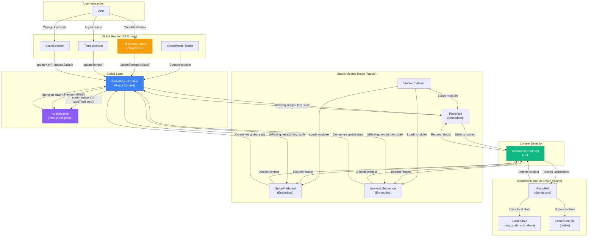

# Brownfield Module System Refactoring - Architecture Document

**Epic:** 14 - Module Adapter System & Global State Integration
**Story:** 14.1 - Brownfield Module System Architecture Design
**Status:** 🚧 IN PROGRESS (Sections 1-5 complete, Sections 6-12 pending) - 42% complete
**Architect:** Winston
**Last Updated:** 2025-01-13
**Checkpoint Recommended:** Yes (create checkpoint before Section 6)

---

## Document Purpose

This architecture document guides the refactoring of Centaurus Drum Machine's module system from brownfield (duplicate local state) to greenfield (unified global state with intelligent context adaptation). It follows the `brownfield-architecture-tmpl.yaml` template and serves as the blueprint for Stories 14.2-14.6 implementation.

**Target State:** Modules detect their context (standalone vs. Studio/Jam) and consume global musical parameters (tempo, key, scale, color mode, transport state) from GlobalMusicContext while preserving standalone view functionality through graceful degradation.

---

## Section 1: Introduction

### Existing Project Analysis

**Current Project State:**
- **Project**: Centaurus Drum Machine v4 - Web-based music creation platform with 5 interactive modules
- **Tech Stack**: React 18.2.0 + TypeScript 5.2.2, Vite 5.0.8, Tailwind CSS 3.3.6, Tone.js 15.1.22
- **Architecture Style**: Component-based React with GlobalMusicContext (Epic 4 foundation)
- **Deployment**: Static web application, no server dependencies, localStorage for persistence
- **Current Routes**:
  - Standalone views: `/piano`, `/guitar-fretboard`, `/isometric`, `/drum-machine`, `/dj-visualizer`
  - Multi-module views: `/studio` (dynamic module loading), `/jam` (collaborative sessions)

**Available Documentation:**
- ✅ **Epic 4 (COMPLETE)**: Global Music Controls foundation
  - Story 4.1: GlobalMusicContext with tempo, key, scale, colorMode, masterVolume
  - Story 4.2: GlobalMusicHeader component (persistent header with controls)
  - Story 4.7: Module loading system for Studio/Jam
- 🚧 **Epic 13 (IN PROGRESS)**: Documentation Infrastructure & Reconciliation
  - Story 13.1 (COMPLETE): Documentation standards, templates, PRD consolidation plan
  - Story 13.2 (IN PROGRESS): Epic/story reconciliation, architecture updates
- 📋 **Reconciliation Audit**: Documents gaps (11 outdated stories, 12 undocumented components)

**Identified Constraints:**
1. **No Breaking Changes**: Standalone views (`/piano`, `/guitar-fretboard`, etc.) must continue functioning identically
2. **Epic 4 Foundation**: Must build on existing GlobalMusicContext infrastructure
3. **Always-Mount Pattern**: Modules use CSS visibility control (proven in JamSession), no unmount/remount
4. **Documentation Alignment**: Coordinates with Epic 13 consolidation (epic/story numbers may shift during reconciliation)

### Module Inventory & Control Analysis

| Module | User Story | Current Controls | Global Candidates | Local Candidates | Integration Status |
|--------|-----------|------------------|-------------------|------------------|-------------------|
| **PianoRoll** | "As a musician, I want to play piano with MIDI input and see chord progressions highlighted on keys, so that I can learn music theory while composing" | • Key/Scale selector<br>• Color mode toggle<br>• Chord progression display<br>• Sound engine selector<br>• WLED/LUMI config | Tempo, Key, Scale, Color Mode, Master Volume, Transport State | Sound engine, WLED config, visualization preferences | ❌ Not integrated<br>(local state only) |
| **GuitarFretboard** | "As a guitarist, I want to visualize chord shapes across the fretboard with configurable tunings, so that I can learn new chords and practice transitions" | • Key/Scale selector<br>• Color mode toggle<br>• Chord progression<br>• Tuning selector<br>• WLED matrix config | Tempo, Key, Scale, Color Mode, Master Volume, Transport State | Tuning selector, chord progression content, WLED config | ❌ Not integrated<br>(uses local `useMusicalScale` hook) |
| **IsometricSequencer** | "As a producer, I want a 3D note grid sequencer with harmonic mode highlighting scale degrees, so that I can create melodic patterns efficiently" | • Tempo/BPM slider<br>• Key/Scale selector<br>• Harmonic mode toggle<br>• APC40 control<br>• LED visualization | Tempo, Key, Scale, Color Mode, Master Volume, Transport State | APC40 mapping, LED routing, pattern data | ❌ Not integrated<br>(local tempo/key/scale state) |
| **DrumMachine** | "As a beat maker, I want a 16-step sequencer with tempo sync and pattern management, so that I can create rhythmic foundations" | • Tempo slider<br>• Play/Stop button<br>• Pattern management<br>• Sample selector | Tempo, Color Mode, Master Volume, Transport State | Pattern data, sample selection, individual track settings | ⚠️ Partially integrated<br>(receives tempo/colorMode from DrumMachineModule wrapper) |
| **LiveAudioVisualizer** | "As a DJ, I want real-time audio spectrum visualization with LED matrix output, so that I can create immersive visual performances" | • Mic input selector<br>• Visualization mode<br>• LED matrix config<br>• Color mapping | Master Volume (optional), Color Mode | Mic input, visualization mode, LED config, audio analysis settings | ❌ Not integrated<br>(always-on, independent of transport state) |

**Control Classification:**

**Global Controls** (managed by GlobalMusicContext):
- ✅ Tempo (BPM) - Required for synchronization across sequencer modules
- ✅ Key (Root Note) - Musical context for all harmonic instruments
- ✅ Scale (Scale Name) - Harmonic framework for all modules
- ✅ Color Mode (chromatic vs. harmonic) - Visualization consistency
- ✅ Master Volume - Audio output level
- 🆕 Transport State (play/pause) - **NEW for Epic 14** - Global playback control

**Local Controls** (module-specific settings):
- Sound Engines (Piano: acoustic/electric/synth, Guitar: acoustic/electric)
- Hardware Routing (WLED device selection, MIDI device assignment)
- Visualization Preferences (LED brightness, color mapping intensity)
- Pattern Data (sequencer note data, drum patterns)
- Module-Specific UI (tuning selector for Guitar, APC40 mapping for Isometric)

**TBD - Requires Product Owner Research** (deferred to user story mapping):
- LED Routing Strategy: Per-module WLED config vs. global routing table?
- Hardware Sharing: Can Piano and Guitar both send to LUMI simultaneously?
- Chord Progression System: Global "chord mode" vs. module-specific content?
- Transport Edge Cases: Should visualizers pause on global stop? Module-level play override behavior?

### Design Principles

**Design Principle #1: Global Transport Control**
- **Pattern**: DAW/MTC-style master transport (Digital Audio Workstation / MIDI Time Code standard)
- **Implementation**: Global play/pause in GlobalMusicHeader affects all sequencer/instrument modules
- **Edge Cases**:
  - Visualizers continue running (always-on for live audio feedback)
  - Modules retain individual play/pause for performance flexibility (DJ can start/stop modules independently during live performance)
- **Rationale**: Industry standard (Ableton Live, Logic Pro, FL Studio), DAWLESS hardware workflows (MIDI MTC start/stop)

**Design Principle #2: Standalone View Preservation**
- **Pattern**: Context detection with graceful degradation
- **Implementation**: Modules function standalone with local state fallback, consume GlobalMusicContext when embedded
- **Backward Compatibility**: No breaking changes to existing routes (`/piano`, `/guitar-fretboard`, etc.)
- **Rationale**: Users share direct links (e.g., `/piano` for music education demos, `/dj-visualizer` for performance)

**Design Principle #3: Always-Mount Pattern**
- **Pattern**: CSS visibility control (proven in JamSession implementation)
- **Implementation**: All modules rendered, CSS controls visibility (`display: none` vs. `display: block`)
- **Audio Benefits**: Audio contexts persist, no pops/clicks from re-initialization
- **Rationale**: Professional DAW behavior, maintains visualizations, prevents audio glitches

**Design Principle #4: Documentation Alignment**
- **Pattern**: Architecture coordinates with Epic 13 documentation consolidation
- **Context**: Epic/story numbers may shift during reconciliation (Epics 1-4 moving from `docs/prd/` to `docs/epics/`)
- **Implementation**: Architecture references current structure with awareness of pending changes
- **Rationale**: Prevents architecture/documentation drift during parallel infrastructure work

---

## Section 2: Enhancement Scope & Integration Strategy

### Enhancement Overview

**Enhancement Type:** Brownfield Refactoring with Progressive Enhancement
**Scope:** Transform 5 modules from duplicate local state to unified global state with intelligent context adaptation
**Integration Impact:** Medium-High - Affects 5 modules, GlobalMusicContext, GlobalMusicHeader, but maintains full backward compatibility

### Code Integration Strategy

**Pattern: Module Adapter with Context Detection**

**Core Hook - `useModuleContext()`:**
```typescript
// src/hooks/useModuleContext.ts
import { useLocation } from 'react-router-dom';

export type ModuleContext = 'standalone' | 'studio' | 'jam';

export const useModuleContext = (): ModuleContext => {
  const location = useLocation();

  if (location.pathname.startsWith('/studio')) {
    return 'studio';
  }

  if (location.pathname.startsWith('/jam')) {
    return 'jam';
  }

  return 'standalone';
};
```

**Module Implementation Pattern (Example: PianoRoll):**
```typescript
// src/components/PianoRoll/PianoRoll.tsx
import { useModuleContext } from '@/hooks/useModuleContext';
import { useGlobalMusic } from '@/contexts/GlobalMusicContext';

export const PianoRoll: React.FC<PianoRollProps> = ({ onBack }) => {
  const context = useModuleContext();
  const globalMusic = useGlobalMusic();

  // Local state fallback for standalone mode
  const [localKey, setLocalKey] = useState<RootNote>('C');
  const [localScale, setLocalScale] = useState<ScaleName>('major');
  const [localColorMode, setLocalColorMode] = useState<ColorMode>('chromatic');

  // Graceful degradation: use global state when embedded, local state when standalone
  const key = context === 'standalone' ? localKey : globalMusic.key;
  const scale = context === 'standalone' ? localScale : globalMusic.scale;
  const tempo = context === 'standalone' ? 120 : globalMusic.tempo;
  const colorMode = context === 'standalone' ? localColorMode : globalMusic.colorMode;

  // Conditional control rendering
  const showLocalControls = context === 'standalone';

  return (
    <div className="piano-roll-container">
      {/* Local controls only shown when standalone */}
      {showLocalControls && (
        <div className="local-controls">
          <ScaleSelector
            selectedRoot={key}
            selectedScale={scale}
            onRootChange={setLocalKey}
            onScaleChange={setLocalScale}
          />
          <ColorModeToggle
            mode={colorMode}
            onModeChange={setLocalColorMode}
          />
        </div>
      )}

      {/* Core piano roll functionality uses resolved state */}
      <PianoGrid
        key={key}
        scale={scale}
        tempo={tempo}
        colorMode={colorMode}
      />
    </div>
  );
};
```

**Key Features:**
- **No prop drilling**: Context detection is internal to each module
- **TypeScript support**: ModuleContext enum provides type safety
- **Graceful degradation**: Modules work standalone even if GlobalMusicContext unavailable
- **Progressive enhancement**: Modules can be refactored incrementally (one at a time)

### Database Integration

**Status:** No Database Changes Required

**Rationale:**
- Project uses localStorage only (no backend database)
- Musical parameters (tempo, key, scale, colorMode) already persisted via GlobalMusicContext (Epic 4 Story 4.1)
- **Transport state (play/pause) NOT persisted** - prevents confusing "auto-play on reload" behavior
- Pattern data remains in component state or localStorage (existing patterns maintained)

**localStorage Schema (No Changes):**
```typescript
// Existing localStorage keys (Epic 4)
localStorage.getItem('centaurus-tempo');        // number (40-300)
localStorage.getItem('centaurus-key');          // RootNote
localStorage.getItem('centaurus-scale');        // ScaleName
localStorage.getItem('centaurus-colorMode');    // 'chromatic' | 'harmonic'
localStorage.getItem('centaurus-masterVolume'); // number (0-100)

// Transport state NOT persisted (in-memory only)
// Rationale: User expectations - DAWs don't auto-play on project open
```

### API Integration

**Status:** No API Changes Required

**Rationale:**
- Client-side only application (no backend)
- Web APIs used: Web MIDI, Web Audio, WLED HTTP/UDP (existing Epic 4 patterns)
- Module adapter pattern uses React Context API (existing infrastructure)

### UI Integration

**Pattern: Progressive Enhancement with Conditional Rendering**

**Global Controls (GlobalMusicHeader):**
- ✅ Existing: Tempo, Key, Scale, Color Mode, Master Volume (Epic 4 Story 4.2)
- 🆕 NEW: Transport controls (Play/Pause buttons) - **Epic 14 Story 14.2**
- Position: Persistent header above all routes (already implemented in `App.tsx`)

**Module Control Hiding:**
```typescript
// Pattern: Hide redundant controls when embedded
const showLocalControls = context === 'standalone';

{showLocalControls && (
  <div className="module-local-controls">
    <ScaleSelector {...} />
    <TempoControl {...} />
  </div>
)}
```

**ViewTemplate Compliance:**
- Modules continue using ViewTemplate for consistent layout
- Back button, title, subtitle positioning unchanged
- Control sections conditionally rendered based on context

### Compatibility Requirements

**Backward Compatibility:**
- ✅ **Full backward compatibility** - All new fields optional in GlobalMusicContext
- ✅ **Standalone views preserved** - `/piano`, `/guitar-fretboard`, `/isometric`, `/drum-machine`, `/dj-visualizer` function identically
- ✅ **No breaking changes** to existing component props, interfaces, exports
- ✅ **Existing routes unchanged** - All current routes continue working

**Performance Impact:**
- **Low impact** - Leverages existing Epic 4 optimizations:
  - GlobalMusicContext memoization (React.useMemo)
  - localStorage debouncing (500ms)
  - Audio engine singleton pattern (no re-initialization)
- **Transport state updates**: <50ms response time (DAW-grade responsiveness)
- **Module loading**: Uses existing always-mount pattern (no mount/unmount overhead)

### Boundary Definition

**What This Enhancement DOES:**
- ✅ Unify tempo, key, scale, color mode across modules in Studio/Jam
- ✅ Add global transport control (play/pause) in GlobalMusicHeader
- ✅ Create module adapter pattern for context detection
- ✅ Eliminate duplicate controls (key/scale in 3 modules, tempo in 2)
- ✅ Preserve standalone view functionality (graceful degradation)
- ✅ Extend GlobalMusicContext with transport state

**What This Enhancement DOES NOT DO:**
- ❌ Change standalone view behavior (they remain fully functional)
- ❌ Add new hardware integrations (existing MIDI/WLED patterns maintained)
- ❌ Modify existing Epic 4 infrastructure (builds on, doesn't replace)
- ❌ Add backend/database (remains client-side only)
- ❌ Change existing localStorage schema (only adds in-memory transport state)
- ❌ Resolve TBD questions (LED routing, hardware sharing, chord sync) - requires Product Owner research

**Deferred to Future Work:**
- LED routing strategy (per-module vs. global routing table)
- Hardware sharing arbitration (MIDI/WLED device management)
- Chord progression system (global mode vs. module-specific content)
- Transport edge cases (visualizer stop behavior, module-level override)

---

## Section 3: Tech Stack

### Existing Technology Stack

**No New Dependencies Required** - This enhancement uses only existing technologies and browser-native APIs.

| Category | Technology | Version | Role in Enhancement | Notes |
|----------|-----------|---------|---------------------|--------|
| **Frontend Framework** | React | 18.2.0 | Context API for module adapter pattern | Existing GlobalMusicContext foundation (Epic 4) |
| **Language** | TypeScript | 5.2.2 | Type safety for ModuleContext enum, interfaces | Strict mode compliance maintained |
| **Build Tool** | Vite | 5.0.8 | No changes to build pipeline | HMR supports incremental refactoring |
| **Styling** | Tailwind CSS | 3.3.6 | Control hiding via conditional rendering | Existing design tokens maintained |
| **Audio Engine** | Tone.js | 15.1.22 | Transport state synchronization | Extends existing singleton pattern |
| **Icons** | Lucide React | 0.294.0 | Play/Pause icons for transport controls | Consistent icon system |
| **Routing** | React Router | 6.x | Context detection via `useLocation()` | Core to module adapter pattern |
| **State Management** | React Context API | 18.2.0 | GlobalMusicContext extension | Epic 4 foundation, zero new dependencies |

### Browser APIs (No External Dependencies)

| API | Purpose | Integration Method | Existing Usage |
|-----|---------|-------------------|----------------|
| **Web MIDI API** | Hardware integration (LUMI, APC40) | Direct browser API | ✅ Epic 4 Story 4.4 |
| **Web Audio API** | Audio engine, master volume control | Tone.js abstraction | ✅ Epic 4 Story 4.3 |
| **Performance.now()** | High-precision timing for LED sync | Native timing | ✅ Epic 4 Story 4.5 |
| **localStorage** | Musical parameter persistence | Direct API | ✅ Epic 4 Story 4.1 |

### Version Compatibility

**React 18.2.0 Features Used:**
- ✅ Hooks (useState, useEffect, useContext, useMemo) - Existing patterns
- ✅ Context API with memoization - Epic 4 GlobalMusicContext foundation
- ✅ React Router integration - useLocation() for context detection

**TypeScript 5.2.2 Features:**
- ✅ Strict mode compliance - Enforced via tsconfig.json
- ✅ Enums (ModuleContext: 'standalone' | 'studio' | 'jam')
- ✅ Interface extensions (GlobalMusicState with transport state)

**Tone.js 15.1.22 Integration:**
- ✅ Transport.start() / Transport.stop() - Global play/pause implementation
- ✅ Existing singleton pattern maintained - No audio re-initialization
- ✅ Scheduler precision - <5ms timing accuracy for LED synchronization

### Technology Selection Rationale

**Why No New Dependencies:**
1. **Epic 4 Foundation Sufficient** - GlobalMusicContext provides all required infrastructure
2. **React Router Built-In** - useLocation() hook enables context detection without additional libraries
3. **Browser APIs Adequate** - No external state management library needed (Redux, Zustand)
4. **Minimal Bundle Impact** - Zero bytes added to production bundle
5. **Maintenance Simplicity** - Fewer dependencies = fewer security updates, breaking changes

**Technology Philosophy Alignment:**
- **Bolt.new Template Standards** - Minimal external dependencies (CLAUDE.md guidance)
- **BMad Framework** - Brownfield enhancement reuses existing infrastructure
- **Production-Ready** - Proven technologies (React 18.2.0, TypeScript 5.2.2) with mature ecosystems

---

## Section 4: Data Models & Schema Changes

### New Type Definitions

#### ModuleContext Enum

**Purpose:** Identifies the execution context of a module to enable intelligent behavior adaptation.

**Location:** `src/types/moduleAdapter.ts` (new file)

```typescript
/**
 * Module execution context
 * Determines how modules consume global state and render controls
 */
export type ModuleContext = 'standalone' | 'studio' | 'jam';
```

**Context Definitions:**
- **`'standalone'`**: Module accessed via direct route (e.g., `/piano`, `/guitar-fretboard`)
  - Uses local state fallback
  - Renders all controls (tempo, key, scale, color mode)
  - Independent operation

- **`'studio'`**: Module loaded in Studio view (`/studio`)
  - Consumes GlobalMusicContext
  - Hides redundant controls (tempo/key/scale in GlobalMusicHeader)
  - Synchronizes with other modules via global state

- **`'jam'`**: Module loaded in JamSession view (`/jam`)
  - Consumes GlobalMusicContext
  - Hides redundant controls
  - Collaborative mode with real-time synchronization

**Detection Logic:** Context determined via React Router's `useLocation()` hook:
```typescript
const location = useLocation();
if (location.pathname.startsWith('/studio')) return 'studio';
if (location.pathname.startsWith('/jam')) return 'jam';
return 'standalone';
```

---

#### GlobalMusicState Extension (Transport State)

**Purpose:** Add global transport control (play/pause) to GlobalMusicContext for DAW-style synchronization.

**Location:** `src/contexts/GlobalMusicContext.tsx` (existing file - extension)

**Current Interface (Epic 4):**
```typescript
export interface GlobalMusicState {
  /** Tempo in BPM (40-300) */
  tempo: number;
  /** Musical root note */
  key: RootNote;
  /** Scale pattern */
  scale: ScaleName;
  /** Visualization mode */
  colorMode: 'chromatic' | 'harmonic';
  /** Master volume (0-1) */
  masterVolume: number;
  /** Hardware configuration */
  hardware: {
    midi: {
      inputDevice: string | null;
      outputDevice: string | null;
      connected: boolean;
    };
    wled: {
      devices: WLEDDevice[];
      activeDeviceId: string | null;
    };
  };
}
```

**NEW Extension (Epic 14):**
```typescript
export interface GlobalMusicState {
  // ... existing fields (above)

  /**
   * Global transport state (play/pause)
   * NEW in Epic 14 - Controls playback synchronization across all modules
   * NOT persisted to localStorage (in-memory only)
   */
  isPlaying: boolean;
}

export interface GlobalMusicContextValue extends GlobalMusicState {
  // ... existing update functions

  /**
   * Update global transport state
   * NEW in Epic 14
   * @param playing - true to play, false to pause
   */
  updateTransportState: (playing: boolean) => void;
}
```

**Implementation Details:**
```typescript
// Default value (always starts paused)
const DEFAULT_STATE: GlobalMusicState = {
  // ... existing defaults
  isPlaying: false, // NEW: Always starts paused
};

// Update function
const updateTransportState = useCallback((playing: boolean) => {
  setState(prev => ({ ...prev, isPlaying: playing }));

  // Sync with Tone.js Transport
  if (playing) {
    audioEngine.startTransport();
  } else {
    audioEngine.stopTransport();
  }
}, []);
```

**Key Design Decision:**
- `isPlaying` is **NOT persisted** to localStorage (excluded from `saveStateToLocalStorage()`)
- **Rationale:** Prevents confusing "auto-play on page reload" behavior
- **User Expectation:** DAWs (Ableton, Logic) don't auto-play when opening projects

---

#### Module Adapter Props (Optional Interface)

**Purpose:** Standardized props for modules that support context adaptation (optional pattern, not required for all modules).

**Location:** `src/types/moduleAdapter.ts` (new file)

```typescript
/**
 * Optional props for module components that support context adaptation
 * Modules can implement this interface to receive context explicitly
 * (Alternative to useModuleContext hook)
 */
export interface ModuleAdapterProps {
  /**
   * Module execution context (optional prop)
   * If not provided, module uses useModuleContext() hook internally
   */
  context?: ModuleContext;

  /**
   * Callback when module-local state changes
   * Allows parent to track module state for debugging/analytics
   */
  onLocalStateChange?: (state: Record<string, any>) => void;
}
```

**Usage Pattern:**
```typescript
// Pattern 1: Hook-based (Recommended - no prop drilling)
export const PianoRoll: React.FC<PianoRollProps> = ({ onBack }) => {
  const context = useModuleContext(); // Internal detection
  // ...
};

// Pattern 2: Prop-based (Optional - for testing or explicit control)
export const PianoRoll: React.FC<PianoRollProps & ModuleAdapterProps> = ({
  onBack,
  context, // Optional prop
  onLocalStateChange
}) => {
  const detectedContext = context || useModuleContext(); // Fallback to detection
  // ...
};
```

**Recommendation:** Use hook-based pattern (Pattern 1) for simplicity. Prop-based pattern useful for:
- Unit testing (inject context without React Router)
- Storybook stories (explicit context control)
- Future server-side rendering (if needed)

---

### Modified Type Definitions

#### AudioEngine Extension (Transport Control)

**Purpose:** Extend AudioEngine singleton with transport control methods.

**Location:** `src/utils/audioEngine.ts` (existing file - extension)

```typescript
class AudioEngine {
  // ... existing methods

  /**
   * Start global transport (play)
   * NEW in Epic 14
   */
  startTransport(): void {
    if (Tone.Transport.state !== 'started') {
      Tone.Transport.start();
      console.log('[AudioEngine] Transport started');
    }
  }

  /**
   * Stop global transport (pause)
   * NEW in Epic 14
   */
  stopTransport(): void {
    if (Tone.Transport.state === 'started') {
      Tone.Transport.pause();
      console.log('[AudioEngine] Transport paused');
    }
  }

  /**
   * Get current transport state
   * NEW in Epic 14
   */
  isTransportPlaying(): boolean {
    return Tone.Transport.state === 'started';
  }
}
```

---

### localStorage Schema (No Changes)

**Storage Key:** `centaurus-global-music-state`

**Schema Version:** `1` (unchanged from Epic 4)

**Stored Fields (Existing):**
```typescript
interface StoredState {
  version: number;           // Schema version (1)
  state: GlobalMusicState;   // Global music state
  timestamp: string;         // ISO timestamp
}

// Fields persisted to localStorage (Epic 4)
{
  "version": 1,
  "timestamp": "2025-01-13T12:00:00.000Z",
  "state": {
    "tempo": 120,
    "key": "C",
    "scale": "major",
    "colorMode": "chromatic",
    "masterVolume": 0.7,
    "hardware": {
      "midi": { /* ... */ },
      "wled": { /* ... */ }
    }
    // NOTE: "isPlaying" field NOT included in localStorage
  }
}
```

**Transport State Exclusion:**
```typescript
/**
 * Save state to localStorage
 * EXCLUDES transport state (isPlaying) - in-memory only
 */
function saveStateToLocalStorage(state: GlobalMusicState): void {
  const { isPlaying, ...persistedState } = state; // Exclude isPlaying

  const stored: StoredState = {
    version: STORAGE_VERSION,
    state: persistedState, // Only persisted fields
    timestamp: new Date().toISOString(),
  };

  localStorage.setItem(STORAGE_KEY, JSON.stringify(stored));
}
```

**Rationale for Exclusion:**
- **User Expectation:** DAWs don't auto-play when opening projects
- **Confusion Prevention:** Page reload shouldn't trigger unexpected audio playback
- **Professional Behavior:** User explicitly initiates playback via Play button

**Default Loading Behavior:**
```typescript
function loadStateFromLocalStorage(): GlobalMusicState {
  const stored = /* ... load and parse ... */;

  return {
    ...DEFAULT_STATE,
    ...stored,
    isPlaying: false, // ALWAYS false on load (never persisted)
  };
}
```

---

### Type Safety & Validation

**TypeScript Strict Mode Compliance:**
- All new interfaces use strict null checks (`string | null` explicitly defined)
- Enum types use union literals (`'standalone' | 'studio' | 'jam'`) for autocomplete
- Optional props marked with `?` (e.g., `context?: ModuleContext`)

**Runtime Validation:**
```typescript
// Transport state validation (updateTransportState)
const updateTransportState = useCallback((playing: boolean) => {
  if (typeof playing !== 'boolean') {
    console.warn(`Invalid transport state: ${playing}. Must be boolean.`);
    return;
  }
  setState(prev => ({ ...prev, isPlaying: playing }));
}, []);
```

**Context Detection Validation:**
```typescript
// useModuleContext hook validation
export const useModuleContext = (): ModuleContext => {
  const location = useLocation();

  // Explicit pathname checks (type-safe)
  if (location.pathname.startsWith('/studio')) return 'studio';
  if (location.pathname.startsWith('/jam')) return 'jam';
  return 'standalone';

  // Return type guaranteed to be ModuleContext union literal
};
```

---

### Migration Path (Backward Compatibility)

**Phase 1: Add Transport State (Non-Breaking)**
```typescript
// GlobalMusicContext.tsx - Add optional field
export interface GlobalMusicState {
  // ... existing fields
  isPlaying?: boolean; // Optional initially (default: false)
}

// Default value ensures backward compatibility
const DEFAULT_STATE = {
  // ... existing
  isPlaying: false,
};
```

**Phase 2: Make Required (After Modules Adopt)**
```typescript
// After Stories 14.3-14.6 complete, remove optional flag
export interface GlobalMusicState {
  // ... existing fields
  isPlaying: boolean; // Now required
}
```

**Type Safety During Migration:**
- TypeScript enforces gradual adoption (optional → required)
- Modules handle `isPlaying === undefined` gracefully during transition
- No runtime errors if modules access `isPlaying` before implementation

---

### Summary Table

| Type | Location | Purpose | Breaking Change? |
|------|----------|---------|------------------|
| `ModuleContext` | `src/types/moduleAdapter.ts` (NEW) | Context detection enum | No - new file |
| `GlobalMusicState.isPlaying` | `src/contexts/GlobalMusicContext.tsx` | Transport state field | No - optional initially |
| `updateTransportState()` | `src/contexts/GlobalMusicContext.tsx` | Transport control method | No - new method |
| `ModuleAdapterProps` | `src/types/moduleAdapter.ts` (NEW) | Optional module props | No - new interface |
| `AudioEngine.startTransport()` | `src/utils/audioEngine.ts` | Start transport | No - new method |
| `AudioEngine.stopTransport()` | `src/utils/audioEngine.ts` | Stop transport | No - new method |
| localStorage schema | No changes | Existing Epic 4 schema | No - unchanged |

---

## Section 5: Component Architecture

### Overview

This section documents the component-level implementation of the module adapter pattern, including the `useModuleContext()` hook, GlobalMusicContext extensions, module refactoring patterns, and transport control integration.

**Key Architectural Patterns:**
1. **Context Detection Hook** - `useModuleContext()` for intelligent behavior adaptation
2. **Graceful Degradation** - Modules function standalone with local state fallback
3. **Conditional Rendering** - Hide redundant controls when embedded
4. **Transport Synchronization** - Global play/pause with module flexibility

---

### Core Hook: useModuleContext

**File:** `src/hooks/useModuleContext.ts` (NEW)

**Purpose:** Detect module execution context (standalone vs. studio vs. jam) without prop drilling.

**Implementation:**
```typescript
import { useLocation } from 'react-router-dom';

/**
 * Module execution context
 * Determines how modules consume global state and render controls
 */
export type ModuleContext = 'standalone' | 'studio' | 'jam';

/**
 * Hook to detect module execution context
 * Uses React Router location to determine if module is:
 * - 'standalone': Direct route access (/piano, /guitar-fretboard, etc.)
 * - 'studio': Loaded in Studio multi-module view
 * - 'jam': Loaded in JamSession collaborative view
 *
 * @returns ModuleContext enum value
 *
 * @example
 * const context = useModuleContext();
 * const showLocalControls = context === 'standalone';
 */
export const useModuleContext = (): ModuleContext => {
  const location = useLocation();

  // Studio view detection
  if (location.pathname.startsWith('/studio')) {
    return 'studio';
  }

  // Jam session detection
  if (location.pathname.startsWith('/jam')) {
    return 'jam';
  }

  // Default to standalone (direct module access)
  return 'standalone';
};
```

**Design Rationale:**
- **Simple**: Single responsibility - context detection only
- **Type-Safe**: Returns union literal type for autocomplete
- **Zero Dependencies**: Uses existing React Router (no new deps)
- **Testable**: Can mock `useLocation()` for unit tests
- **Fast**: Pathname string check (no regex, no complex logic)

**Usage Example:**
```typescript
const context = useModuleContext();

// Conditional logic based on context
if (context === 'standalone') {
  // Use local state, show all controls
} else {
  // Use global state, hide redundant controls
}
```

---

### GlobalMusicContext Extension

**File:** `src/contexts/GlobalMusicContext.tsx` (MODIFIED)

**Extension:** Add transport state (`isPlaying`) and update function (`updateTransportState`)

**Modified Sections:**

#### 1. State Interface Extension
```typescript
export interface GlobalMusicState {
  // ... existing fields (tempo, key, scale, colorMode, masterVolume, hardware)

  /**
   * Global transport state (play/pause)
   * NEW in Epic 14 - Controls playback synchronization across all modules
   * NOT persisted to localStorage (in-memory only)
   * @default false - always starts paused
   */
  isPlaying: boolean; // NEW
}
```

#### 2. Context Value Extension
```typescript
export interface GlobalMusicContextValue extends GlobalMusicState {
  // ... existing update functions

  /**
   * Update global transport state
   * NEW in Epic 14
   * Synchronizes Tone.js Transport with global state
   * @param playing - true to start playback, false to pause
   */
  updateTransportState: (playing: boolean) => void; // NEW
}
```

#### 3. Default State Update
```typescript
const DEFAULT_STATE: GlobalMusicState = {
  tempo: 120,
  key: 'C',
  scale: 'major',
  colorMode: 'chromatic',
  masterVolume: 0.7,
  hardware: { /* ... */ },
  isPlaying: false, // NEW: Always starts paused
};
```

#### 4. Update Function Implementation
```typescript
/**
 * Update global transport state
 * Syncs React state with Tone.js Transport
 */
const updateTransportState = useCallback((playing: boolean) => {
  // Validation
  if (typeof playing !== 'boolean') {
    console.warn(`[GlobalMusicContext] Invalid transport state: ${playing}. Must be boolean.`);
    return;
  }

  // Update React state
  setState(prev => ({ ...prev, isPlaying: playing }));

  // Sync with Tone.js Transport
  if (playing) {
    audioEngine.startTransport();
    console.log('[GlobalMusicContext] Transport started');
  } else {
    audioEngine.stopTransport();
    console.log('[GlobalMusicContext] Transport stopped');
  }
}, []);
```

#### 5. localStorage Exclusion
```typescript
/**
 * Save state to localStorage
 * EXCLUDES isPlaying field (in-memory only)
 */
function saveStateToLocalStorage(state: GlobalMusicState): void {
  const { isPlaying, ...persistedState } = state; // Destructure to exclude

  const stored: StoredState = {
    version: STORAGE_VERSION,
    state: persistedState, // Only persisted fields
    timestamp: new Date().toISOString(),
  };

  localStorage.setItem(STORAGE_KEY, JSON.stringify(stored));
}
```

#### 6. Context Value Memoization Update
```typescript
const contextValue = useMemo<GlobalMusicContextValue>(
  () => ({
    ...state,
    updateTempo,
    updateKey,
    updateScale,
    updateColorMode,
    updateMasterVolume,
    updateMidiInput,
    updateMidiOutput,
    updateMidiConnected,
    updateWLEDDevices,
    updateActiveWLEDDevice,
    updateTransportState, // NEW
    // Musical scale utilities
    getCurrentScale: musicalScale.getCurrentScale,
    isNoteInScale: musicalScale.isNoteInScale,
    getScaleDisplayName: musicalScale.getScaleDisplayName,
    getKeySignature: musicalScale.getKeySignature,
    rootNotes: musicalScale.rootNotes,
    scaleNames: musicalScale.scaleNames,
  }),
  [
    state,
    updateTempo,
    updateKey,
    updateScale,
    updateColorMode,
    updateMasterVolume,
    updateMidiInput,
    updateMidiOutput,
    updateMidiConnected,
    updateWLEDDevices,
    updateActiveWLEDDevice,
    updateTransportState, // NEW
    musicalScale.getCurrentScale,
    musicalScale.isNoteInScale,
    musicalScale.getScaleDisplayName,
    musicalScale.getKeySignature,
    musicalScale.rootNotes,
    musicalScale.scaleNames,
  ]
);
```

---

### AudioEngine Extension

**File:** `src/utils/audioEngine.ts` (MODIFIED)

**Extension:** Add transport control methods

```typescript
class AudioEngine {
  // ... existing methods (initializeSynth, playNote, setMasterVolume, etc.)

  /**
   * Start global transport (play)
   * NEW in Epic 14
   * Idempotent - safe to call multiple times
   */
  startTransport(): void {
    if (Tone.Transport.state !== 'started') {
      Tone.Transport.start();
      console.log('[AudioEngine] Transport started');
    } else {
      console.log('[AudioEngine] Transport already started');
    }
  }

  /**
   * Stop global transport (pause)
   * NEW in Epic 14
   * Uses pause() instead of stop() to maintain Transport position
   * Idempotent - safe to call multiple times
   */
  stopTransport(): void {
    if (Tone.Transport.state === 'started') {
      Tone.Transport.pause();
      console.log('[AudioEngine] Transport paused');
    } else {
      console.log('[AudioEngine] Transport already stopped');
    }
  }

  /**
   * Get current transport state
   * NEW in Epic 14
   * @returns true if transport is playing, false otherwise
   */
  isTransportPlaying(): boolean {
    return Tone.Transport.state === 'started';
  }

  /**
   * Sync transport BPM with global tempo
   * EXISTING - Extended documentation
   * @param bpm - Tempo in beats per minute (40-300)
   */
  syncTransportBPM(bpm: number): void {
    Tone.Transport.bpm.value = bpm;
    console.log(`[AudioEngine] Transport BPM synced: ${bpm}`);
  }
}
```

**Design Notes:**
- **Idempotent**: Methods check state before acting (safe to call multiple times)
- **Pause vs. Stop**: Uses `pause()` to maintain playback position (DAW standard)
- **Console Logging**: Aids manual debugging in DevTools

---

### Module Refactoring Pattern (PianoRoll Example)

**File:** `src/components/PianoRoll/PianoRoll.tsx` (MODIFIED)

**Pattern:** Context detection → Graceful degradation → Conditional rendering

**Before (Brownfield - Local State Only):**
```typescript
export const PianoRoll: React.FC<PianoRollProps> = ({ onBack }) => {
  // Local state (no global integration)
  const [colorMode, setColorMode] = useState<ColorMode>('chromatic');
  const [selectedRoot, setSelectedRoot] = useState('C');
  const [selectedScale, setSelectedScale] = useState('major');
  const [tempo] = useState(120); // Hardcoded

  return (
    <ViewTemplate title="Piano Roll" onBack={onBack}>
      {/* Local controls always shown */}
      <ViewCard title="Settings">
        <ScaleSelector
          selectedRoot={selectedRoot}
          selectedScale={selectedScale}
          onRootChange={setSelectedRoot}
          onScaleChange={setSelectedScale}
        />
        <ColorModeToggle mode={colorMode} onModeChange={setColorMode} />
      </ViewCard>

      <ViewCard title="Piano">
        <PianoGrid
          key={selectedRoot}
          scale={selectedScale}
          tempo={tempo}
          colorMode={colorMode}
        />
      </ViewCard>
    </ViewTemplate>
  );
};
```

**After (Greenfield - Module Adapter Pattern):**
```typescript
import { useModuleContext } from '@/hooks/useModuleContext';
import { useGlobalMusic } from '@/contexts/GlobalMusicContext';

export const PianoRoll: React.FC<PianoRollProps> = ({ onBack }) => {
  // 1. Context detection
  const context = useModuleContext();
  const globalMusic = useGlobalMusic();

  // 2. Local state fallback (for standalone mode)
  const [localKey, setLocalKey] = useState<RootNote>('C');
  const [localScale, setLocalScale] = useState<ScaleName>('major');
  const [localColorMode, setLocalColorMode] = useState<ColorMode>('chromatic');
  const [localTempo] = useState(120); // Hardcoded fallback

  // 3. Graceful degradation: use global state when embedded, local when standalone
  const key = context === 'standalone' ? localKey : globalMusic.key;
  const scale = context === 'standalone' ? localScale : globalMusic.scale;
  const tempo = context === 'standalone' ? localTempo : globalMusic.tempo;
  const colorMode = context === 'standalone' ? localColorMode : globalMusic.colorMode;

  // 4. Conditional control rendering
  const showLocalControls = context === 'standalone';

  // 5. Transport state (if needed for visual feedback)
  const isPlaying = context === 'standalone' ? false : globalMusic.isPlaying;

  return (
    <ViewTemplate title="Piano Roll" onBack={onBack}>
      {/* Local controls only shown when standalone */}
      {showLocalControls && (
        <ViewCard title="Settings">
          <ScaleSelector
            selectedRoot={key}
            selectedScale={scale}
            onRootChange={setLocalKey}
            onScaleChange={setLocalScale}
          />
          <ColorModeToggle mode={colorMode} onModeChange={setLocalColorMode} />
        </ViewCard>
      )}

      {/* Core functionality uses resolved state */}
      <ViewCard title="Piano" large>
        <PianoGrid
          key={key}
          scale={scale}
          tempo={tempo}
          colorMode={colorMode}
          isPlaying={isPlaying} // NEW: Visual feedback
        />
      </ViewCard>

      <ViewCard title="About">
        {context !== 'standalone' && (
          <p className="text-sm text-gray-400">
            Tempo, key, and scale controlled by Global Music Header
          </p>
        )}
        {/* ... rest of documentation */}
      </ViewCard>
    </ViewTemplate>
  );
};
```

**Key Changes:**
1. **Import hooks**: `useModuleContext()` and `useGlobalMusic()`
2. **Detect context**: `const context = useModuleContext()`
3. **Fallback state**: Local state preserved for standalone mode
4. **Conditional resolution**: `context === 'standalone' ? local : global`
5. **Hide controls**: `{showLocalControls && <Controls />}`
6. **Transport awareness**: Pass `isPlaying` to child components for visual feedback

---

### GlobalMusicHeader Extension (Transport Controls)

**File:** `src/components/GlobalMusicHeader/GlobalMusicHeader.tsx` (MODIFIED)

**Extension:** Add Play/Pause buttons for global transport control

**New Component - TransportControls:**
```typescript
import { Play, Pause } from 'lucide-react';

interface TransportControlsProps {
  isPlaying: boolean;
  onTogglePlay: () => void;
}

const TransportControls: React.FC<TransportControlsProps> = ({ isPlaying, onTogglePlay }) => {
  return (
    <button
      onClick={onTogglePlay}
      className={`p-2 rounded-lg transition-all ${
        isPlaying
          ? 'bg-accent-600 hover:bg-accent-700' // Playing: accent color
          : 'bg-primary-600 hover:bg-primary-700' // Paused: primary color
      }`}
      title={isPlaying ? 'Pause' : 'Play'}
      aria-label={isPlaying ? 'Pause global transport' : 'Play global transport'}
    >
      {isPlaying ? (
        <Pause className="w-5 h-5 text-white" />
      ) : (
        <Play className="w-5 h-5 text-white" />
      )}
    </button>
  );
};
```

**Integration into GlobalMusicHeader:**
```typescript
export const GlobalMusicHeader: React.FC = () => {
  const music = useGlobalMusic();
  const { isMobile, isTablet } = useResponsive();
  const [isMobileMenuOpen, setIsMobileMenuOpen] = useState(false);
  const [isHardwareModalOpen, setIsHardwareModalOpen] = useState(false);

  // Transport toggle handler
  const handleTogglePlay = useCallback(() => {
    music.updateTransportState(!music.isPlaying);
  }, [music.isPlaying, music.updateTransportState]);

  return (
    <>
      {/* Hardware Settings Modal */}
      <HardwareSettingsModal
        isOpen={isHardwareModalOpen}
        onClose={() => setIsHardwareModalOpen(false)}
      />

      {/* Main Header Bar */}
      <header className="sticky top-0 z-40 bg-gray-800 border-b border-gray-700 shadow-lg">
        <div className="max-w-7xl mx-auto px-4 py-3">
          {/* Desktop/Tablet Layout */}
          {!isMobile && (
            <div className="flex items-center justify-between gap-4">
              <div className="flex items-center gap-4">
                {/* NEW: Transport Controls */}
                <TransportControls
                  isPlaying={music.isPlaying}
                  onTogglePlay={handleTogglePlay}
                />

                {/* Existing: Tempo Control */}
                <TempoControl
                  tempo={music.tempo}
                  onTempoChange={music.updateTempo}
                  isCompact={isTablet}
                />

                {/* Existing: Scale Selector */}
                <div className="flex items-center gap-2">
                  <ScaleSelector
                    selectedRoot={music.key}
                    selectedScale={music.scale}
                    rootNotes={music.rootNotes}
                    scaleNames={music.scaleNames}
                    onRootChange={music.updateKey}
                    onScaleChange={music.updateScale}
                  />
                </div>
              </div>

              <div className="flex items-center gap-4">
                {/* Existing: Color Mode, Volume, Hardware */}
                <ColorModeToggle mode={music.colorMode} onModeChange={music.updateColorMode} />
                <VolumeSlider
                  volume={music.masterVolume}
                  onVolumeChange={music.updateMasterVolume}
                  isCompact={isTablet}
                />
                {/* ... hardware settings button */}
              </div>
            </div>
          )}

          {/* Mobile Layout */}
          {isMobile && (
            <div>
              <div className="flex items-center justify-between">
                <div className="flex items-center gap-2">
                  <button
                    onClick={() => setIsMobileMenuOpen(!isMobileMenuOpen)}
                    className="p-2 rounded-lg hover:bg-gray-700 transition-colors"
                    aria-label="Toggle Menu"
                  >
                    {isMobileMenuOpen ? (
                      <X className="w-6 h-6 text-white" />
                    ) : (
                      <Menu className="w-6 h-6 text-white" />
                    )}
                  </button>

                  {/* NEW: Transport Controls (Mobile) */}
                  <TransportControls
                    isPlaying={music.isPlaying}
                    onTogglePlay={handleTogglePlay}
                  />

                  <span className="text-white font-semibold">
                    {music.tempo} BPM • {music.getKeySignature()}
                  </span>
                </div>

                <ColorModeToggle mode={music.colorMode} onModeChange={music.updateColorMode} />
              </div>

              {/* Mobile Menu (Collapsible) */}
              {isMobileMenuOpen && (
                <div className="mt-4 space-y-4 pb-2 animate-slideDown">
                  {/* ... existing mobile controls */}
                </div>
              )}
            </div>
          )}
        </div>
      </header>
    </>
  );
};
```

**Design Notes:**
- **Visual Feedback**: Button color changes (primary when paused, accent when playing)
- **Accessibility**: Proper ARIA labels for screen readers
- **Mobile Support**: Transport controls visible in mobile header (not hidden in menu)
- **Responsive**: Maintains 44px minimum touch target

---

### Component Interaction Diagram

**Mermaid Diagram: Module Adapter Pattern Data Flow**



**Diagram Explanation:**

**Flow 1: Global Control Updates (Studio/Jam)**
1. User clicks Play in GlobalMusicHeader
2. TransportControls calls `updateTransportState(true)`
3. GlobalMusicContext updates `isPlaying` state
4. GlobalMusicContext calls `audioEngine.startTransport()`
5. Tone.js Transport starts
6. All embedded modules receive `isPlaying: true` via context
7. Modules update visual feedback (playing state indicators)

**Flow 2: Standalone Module (Local State Fallback)**
1. User navigates to `/piano`
2. PianoRoll calls `useModuleContext()`
3. Hook returns `'standalone'`
4. PianoRoll uses local state (`localKey`, `localScale`, etc.)
5. PianoRoll shows local controls (ScaleSelector visible)
6. No dependency on GlobalMusicContext (graceful degradation)

**Flow 3: Embedded Module (Global State Consumption)**
1. User navigates to `/studio`
2. Studio loads PianoRoll module
3. PianoRoll calls `useModuleContext()`
4. Hook returns `'studio'`
5. PianoRoll consumes GlobalMusicContext state
6. PianoRoll hides local controls (redundant with GlobalMusicHeader)
7. PianoRoll responds to global transport state changes

---

### Component Hierarchy

**Module Adapter Pattern Hierarchy:**

```
App.tsx
├── GlobalMusicProvider (Context)
│   └── GlobalMusicHeader (Persistent, All Routes)
│       ├── TransportControls (NEW)
│       ├── TempoControl
│       ├── ScaleSelector
│       ├── ColorModeToggle
│       └── VolumeSlider
│
├── Route: /piano (Standalone)
│   └── PianoRoll
│       ├── useModuleContext() → 'standalone'
│       ├── Local State (key, scale, colorMode)
│       ├── Local Controls (visible)
│       └── PianoGrid (uses local state)
│
├── Route: /studio (Multi-Module)
│   └── Studio Container
│       ├── PianoRoll
│       │   ├── useModuleContext() → 'studio'
│       │   ├── useGlobalMusic() → global state
│       │   ├── Local Controls (hidden)
│       │   └── PianoGrid (uses global state)
│       │
│       ├── GuitarFretboard
│       │   ├── useModuleContext() → 'studio'
│       │   ├── useGlobalMusic() → global state
│       │   └── ... (same pattern)
│       │
│       └── IsometricSequencer
│           ├── useModuleContext() → 'studio'
│           ├── useGlobalMusic() → global state
│           └── ... (same pattern)
│
└── Route: /jam (Collaborative)
    └── JamSession Container
        ├── PianoRoll (useModuleContext() → 'jam')
        ├── DrumMachine (useModuleContext() → 'jam')
        └── ... (same pattern as studio)
```

---

### Module Refactoring Checklist (Developer Guide)

**Steps to refactor a module (e.g., GuitarFretboard, IsometricSequencer):**

1. **Import hooks:**
   ```typescript
   import { useModuleContext } from '@/hooks/useModuleContext';
   import { useGlobalMusic } from '@/contexts/GlobalMusicContext';
   ```

2. **Add context detection:**
   ```typescript
   const context = useModuleContext();
   const globalMusic = useGlobalMusic();
   ```

3. **Preserve local state (for standalone fallback):**
   ```typescript
   const [localKey, setLocalKey] = useState<RootNote>('C');
   const [localScale, setLocalScale] = useState<ScaleName>('major');
   // ... other local state
   ```

4. **Implement graceful degradation:**
   ```typescript
   const key = context === 'standalone' ? localKey : globalMusic.key;
   const scale = context === 'standalone' ? localScale : globalMusic.scale;
   const tempo = context === 'standalone' ? 120 : globalMusic.tempo;
   const colorMode = context === 'standalone' ? localColorMode : globalMusic.colorMode;
   ```

5. **Conditional control rendering:**
   ```typescript
   const showLocalControls = context === 'standalone';

   {showLocalControls && (
     <ViewCard title="Settings">
       <ScaleSelector {...} />
       <ColorModeToggle {...} />
     </ViewCard>
   )}
   ```

6. **Pass resolved state to child components:**
   ```typescript
   <ModuleCore
     key={key}
     scale={scale}
     tempo={tempo}
     colorMode={colorMode}
     isPlaying={globalMusic.isPlaying}
   />
   ```

7. **Manual verification (browser testing):**
   - Navigate to `/module-name` (standalone) - verify local controls visible
   - Navigate to `/studio` - load module - verify controls hidden
   - Adjust tempo in GlobalMusicHeader - verify module responds
   - Click Play in GlobalMusicHeader - verify module visual feedback
   - Refresh page - verify transport state resets to paused

---

### Summary

**Section 5 Deliverables:**
- ✅ `useModuleContext()` hook implementation and documentation
- ✅ GlobalMusicContext extension (transport state + update function)
- ✅ AudioEngine extension (transport control methods)
- ✅ Module refactoring pattern (PianoRoll example)
- ✅ GlobalMusicHeader extension (TransportControls component)
- ✅ Component interaction diagram (Mermaid)
- ✅ Component hierarchy documentation
- ✅ Developer refactoring checklist (manual verification steps)

**Key Patterns Established:**
1. Context detection via `useLocation()` (no prop drilling)
2. Graceful degradation (local state fallback)
3. Conditional rendering (hide controls when embedded)
4. Transport synchronization (global play/pause with Tone.js)

**No Breaking Changes:**
- All modules work standalone (existing routes preserved)
- Local state maintained as fallback
- Progressive enhancement (refactor modules incrementally)

---

## Section 6: API Design

_[To be completed - will mark N/A for backend APIs, document Web API dependencies]_

---

## Section 7: Source Tree

_[To be completed - will document new files (hooks, types), modified files (modules, GlobalMusicContext)]_

---

## Section 8: Infrastructure & Deployment

_[To be completed - will mark no changes, client-side only]_

---

## Section 9: Coding Standards

_[To be completed - will document context detection patterns, graceful degradation, conditional rendering]_

---

## Section 10: Testing Strategy

_[To be completed - will define unit, integration, regression test plans]_

---

## Section 11: Security Integration

_[To be completed - will mark no changes, no new attack surface]_

---

## Section 12: Next Steps

_[To be completed - will create Story Manager + Developer handoff prompts, phased implementation plan]_

---

## Change Log

| Date | Version | Description | Author |
|------|---------|-------------|--------|
| 2025-01-13 | 0.5 | Added Section 5: Component Architecture (useModuleContext hook, module patterns, Mermaid diagram, manual verification checklist) | Winston (Architect) |
| 2025-01-13 | 0.4 | Added Section 4: Data Models & Schema Changes (transport state, ModuleContext enum) | Winston (Architect) |
| 2025-01-13 | 0.3 | Added Section 3: Tech Stack (zero new dependencies) | Winston (Architect) |
| 2025-01-13 | 0.2 | Added Section 2: Enhancement Scope & Integration Strategy | Winston (Architect) |
| 2025-01-13 | 0.1 | Added Section 1: Introduction with module analysis | Winston (Architect) |
