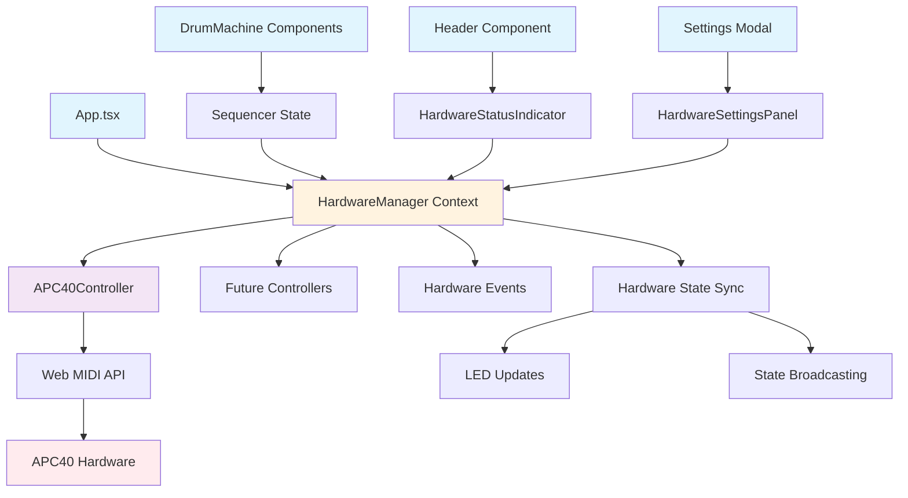

# Component Architecture

## New Components

### HardwareManager
**Responsibility**: Central orchestrator for all hardware controller lifecycle management and coordination  
**Integration Points**: React context provider wrapping existing App component, subscribes to sequencer state changes

**Key Interfaces**:
- `useHardware()` - React hook for accessing hardware state and control functions
- `registerController(controller)` - Plugin system for adding new hardware types
- `broadcastSequencerState(state)` - Distributes sequencer changes to all connected hardware

**Dependencies**:
- **Existing Components**: Subscribes to existing sequencer context/state
- **New Components**: Manages APC40Controller and future controller instances

**Technology Stack**: React Context API, TypeScript interfaces, Web MIDI API integration

### APC40Controller
**Responsibility**: APC40-specific MIDI communication, LED control, and device state management  
**Integration Points**: Implements HardwareController interface, managed by HardwareManager

**Key Interfaces**:
- `connect()` - Establish MIDI connection and device initialization
- `updateLEDs(sequencerState)` - Translate sequencer state to LED patterns
- `handleMIDIInput(event)` - Process hardware button presses and forward to sequencer

**Dependencies**:
- **Existing Components**: None (complete isolation from existing components)
- **New Components**: Communicates through HardwareManager event system

**Technology Stack**: Web MIDI API, APC40-specific MIDI implementation, LED color mapping

### HardwareStatusIndicator
**Responsibility**: Visual feedback for hardware connection status and device information  
**Integration Points**: Composes into existing Header component through props, follows Tailwind design patterns

**Key Interfaces**:
- `connectionStatus` - Display current hardware connection state
- `deviceInfo` - Show connected device details
- `onClick` - Navigate to hardware settings modal

**Dependencies**:
- **Existing Components**: Uses existing Lucide icons, follows Header component patterns
- **New Components**: Receives state from HardwareManager context

**Technology Stack**: React functional component, Tailwind CSS, Lucide React icons

### HardwareSettingsPanel
**Responsibility**: Hardware configuration UI integrated into existing settings modal  
**Integration Points**: Extends existing settings modal architecture, maintains responsive behavior

**Key Interfaces**:
- `hardwareSettings` - APC40 LED brightness, color modes, button sensitivity
- `onSettingsChange` - Persist hardware preferences to localStorage
- `deviceManager` - Multi-hardware coordination settings

**Dependencies**:
- **Existing Components**: Integrates with existing settings modal, follows Tailwind form patterns
- **New Components**: Controls HardwareManager configuration

**Technology Stack**: React functional component, Tailwind CSS forms, localStorage integration

## Component Interaction Diagram

