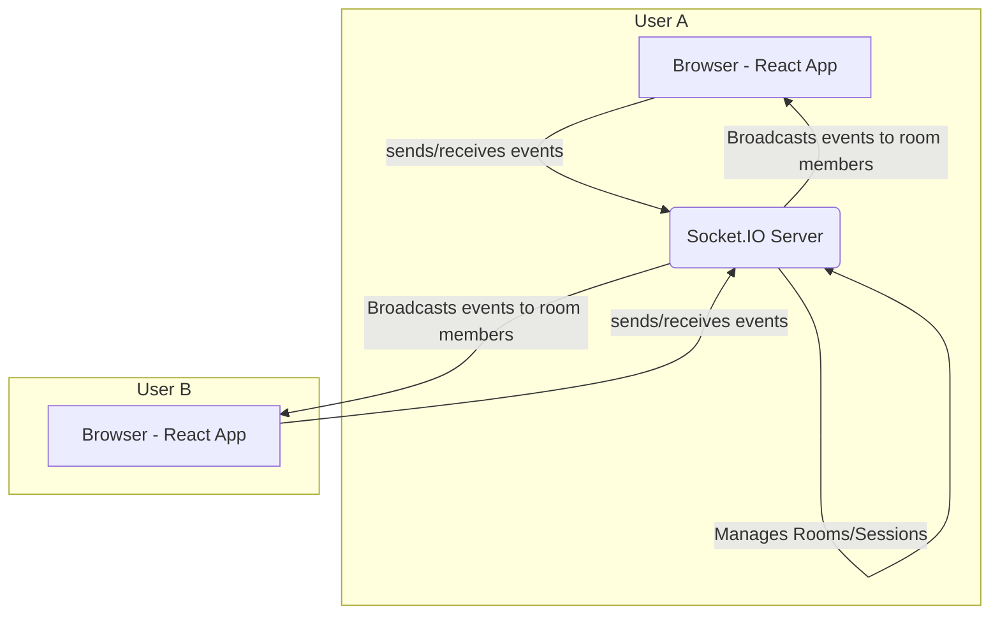

# Architecture: Jam Session Backend

**Version:** 1.0
**Date:** 2024-10-26
**Author:** Winston (Architect)

## 1. Overview

This document outlines the technical architecture for the new real-time Jam Session backend service. This service will manage user sessions, state, and communication for the collaborative music features, integrating with the existing React-based frontend.

## 2. High-Level Architecture

We will implement a **Node.js-based WebSocket server** using the **Socket.IO** library. This server will run as a separate process from the Vite development server and will be responsible for all real-time communication.

### 2.1. Architectural Diagram



### 2.2. Core Components

*   **Socket.IO Server:** A Node.js application that handles WebSocket connections, session management, and event broadcasting.
*   **Session Manager:** A class or module within the server responsible for creating, managing, and deleting jam sessions (rooms).
*   **Client-Side Service:** A TypeScript module in the React app (`src/services/socketService.ts`) to encapsulate all communication with the Socket.IO server.

## 3. Technology Stack

This service will be built using the following technologies:

| Category          | Technology  | Version | Rationale                                                                                             |
| ----------------- | ----------- | ------- | ----------------------------------------------------------------------------------------------------- |
| **Runtime**       | Node.js     | ~18.x   | Consistent with the existing development environment.                                                 |
| **WebSocket Lib** | Socket.IO   | ~4.7.5  | Provides robust features like automatic reconnection and rooms, crucial for a good user experience. |
| **Language**      | TypeScript  | ~5.2.2  | To maintain consistency with the existing frontend codebase and ensure type safety.                    |

## 4. Project Structure

A new `server` directory will be created in the project root to house all backend code, keeping it separate from the frontend application.

```
/ (root)
|-- /src
|   |-- /components
|   |   |-- /JamSession
|   |   |   `-- JamSession.tsx
|   |-- /services
|   |   `-- socketService.ts  <-- NEW
|-- /server                 <-- NEW
|   |-- /src
|   |   |-- /sessions
|   |   |   `-- SessionManager.ts
|   |   `-- index.ts
|   |-- package.json
|   `-- tsconfig.json
|-- package.json
|-- ... (other existing files)
```

## 5. Data Models

We will use the following data structures for managing sessions and users.

```typescript
// In a shared types file, e.g., /packages/shared/types/session.ts

interface Participant {
  id: string; // Unique ID, e.g., socket.id
  name: string;
  // Add other user-specific data as needed
}

interface Session {
  id: string; // The room code
  participants: Map<string, Participant>;
  // Add other session-specific data, e.g., host, settings
}
```

## 6. Communication Protocol (Socket.IO Events)

The following events will define the communication between the client (React app) and the server.

**Client-to-Server Events:**

*   `session:create`: Client requests to create a new session.
*   `session:join` (payload: `{ roomCode: string, user: { name: string } }`): Client requests to join an existing session.
*   `session:leave` (payload: `{ roomCode: string }`): Client notifies the server it is leaving a session.
*   `event:broadcast` (payload: `{ roomCode: string, eventName: string, data: any }`): Client sends a musical or other event to be broadcast to others in the room.

**Server-to-Client Events:**

*   `session:created` (payload: `{ roomCode: string }`): Server confirms a session was created.
*   `session:joined` (payload: `{ roomCode: string, participants: Participant[] }`): Server confirms the user has joined a session and provides the current list of participants.
*   `session:user-joined` (payload: `{ user: Participant }`): Server notifies clients in a room that a new user has joined.
*   `session:user-left` (payload: `{ userId: string }`): Server notifies clients that a user has left.
*   `event:broadcast` (payload: `{ eventName: string, data: any, senderId: string }`): Server broadcasts an event from one client to all others.
*   `error` (payload: `{ message: string }`): Server sends an error message (e.g., room not found, invalid data).

## 7. Next Steps

With this technical plan, the `pm` can now refine the stories in the epic to be more specific and actionable for the `dev` agent.
