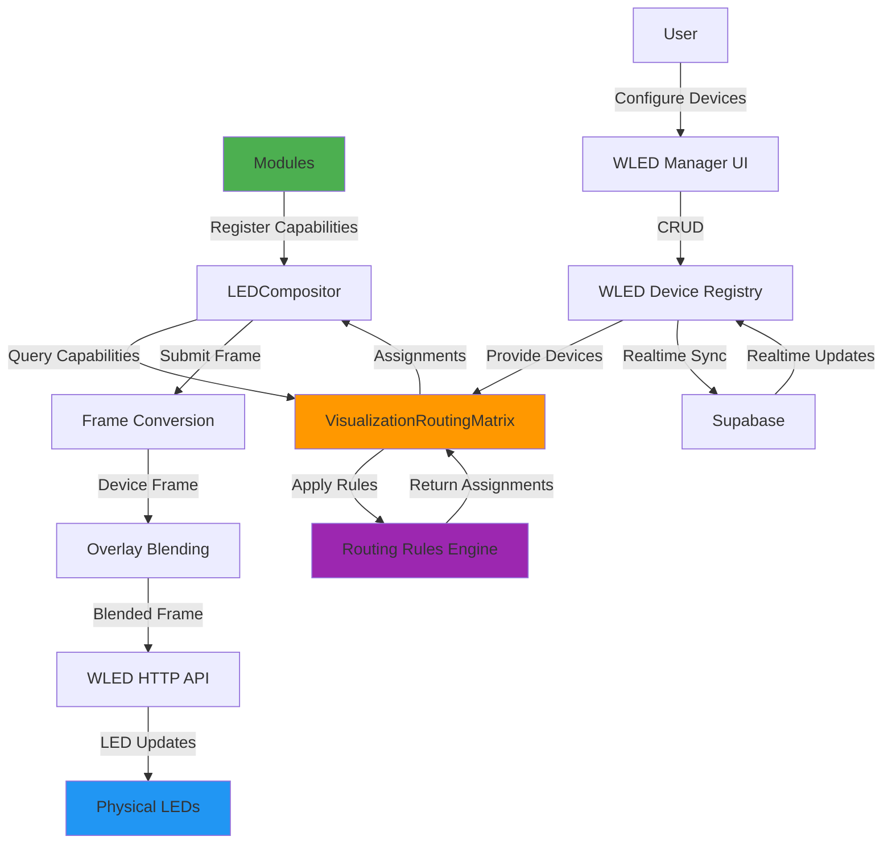

# Story 18.7: Multi-Module Testing & Documentation

**Epic:** Epic 18 - Intelligent WLED Visualization Routing
**Status:** 📝 PLANNING
**Priority:** 🟢 LOW
**Complexity:** Medium
**Time Estimate:** 3-4 hours
**Prerequisites:** Stories 18.0-18.6 (Complete routing system + integration)

---

## User Story

As a **developer or advanced user of the WLED routing system**,
I want **comprehensive documentation and verified test scenarios**,
So that **I understand how the system works and can confidently use it with multiple modules**.

---

## Story Context

### Why This Story

**Validation & Knowledge Transfer:** Story 18.7 validates the complete Epic 18 implementation through comprehensive multi-module testing and creates documentation for developers and users.

**Current State:**
- ✅ Complete routing system implemented (Stories 18.1-18.6)
- ✅ DrumMachine migrated and working
- ❌ No multi-module test scenarios
- ❌ No comprehensive documentation
- ❌ No architecture diagrams
- ❌ No video demo

**Desired State (Story 18.7):**
- ✅ 6+ multi-module test scenarios verified
- ✅ Developer documentation complete
- ✅ Architecture diagram (Mermaid)
- ✅ Video demo showing automatic routing
- ✅ User guide for WLED Manager
- ✅ Troubleshooting guide

**Example Test Scenarios:**

```
Scenario 1: Drum Machine + Audio Reactive (Overlay)
Scenario 2: Guitar + Drum Machine (Device Switching)
Scenario 3: Piano Roll + Audio Reactive (1D Strip Fallback)
Scenario 4: All Modules Active (Complex Routing)
Scenario 5: Device Hot-Swap (Connection Loss & Recovery)
Scenario 6: Multi-User Jam Session (Shared Device Registry)
```

---

## Acceptance Criteria

### Functional Requirements

1. **Multi-Module Test Scenarios**
   - Create 6 comprehensive test scenarios:
     - Scenario 1: Drum Machine + Audio Reactive (overlay)
     - Scenario 2: Guitar + Drum Machine (device switching)
     - Scenario 3: Piano Roll + Audio Reactive (1D fallback)
     - Scenario 4: All Modules Active (complex routing)
     - Scenario 5: Device Hot-Swap (connection loss/recovery)
     - Scenario 6: Multi-User Jam Session (shared devices)
   - Each scenario documented with:
     - Setup steps
     - Expected routing behavior
     - Verification checklist
     - Screenshots/video

2. **Developer Documentation**
   - Create `docs/guides/wled-routing-system.md`:
     - System overview
     - Architecture layers (Device Registry, Capabilities, Routing Matrix, Rules)
     - How to add module capabilities
     - How to create custom routing rules
     - Debugging tips
   - Code examples for common patterns

3. **Architecture Diagram (Mermaid)**
   - Visual diagram showing:
     - Data flow (Module → LEDCompositor → Routing Matrix → WLED Device)
     - Component relationships
     - Integration points
   - Embed in `docs/architecture/wled-visualization-routing.md`

4. **Video Demo**
   - Record 3-5 minute demo showing:
     - WLED Manager UI (add/edit devices)
     - Automatic routing (switch between modules)
     - Overlay behavior (audio reactive on top of other modules)
     - Multi-device routing (grid + strip)
   - Upload to project repo (or link to YouTube/Vimeo)

5. **User Guide**
   - Create `docs/guides/wled-manager-user-guide.md`:
     - Getting started (add first device)
     - Device configuration (1D vs 2D, grid settings)
     - Troubleshooting (connection errors, routing issues)
     - FAQ

6. **Troubleshooting Guide**
   - Create `docs/troubleshooting/wled-routing.md`:
     - Common issues:
       - "Device not responding"
       - "Routing not updating"
       - "Overlays not blending"
       - "Performance issues (dropped frames)"
     - Debug commands (console logs, debug functions)
     - How to report bugs

### Integration Requirements

7. **Test Coverage Matrix**
   - Document test coverage:
     - Unit tests (routing matrix, rules engine)
     - Integration tests (LEDCompositor + routing)
     - Manual tests (multi-module scenarios)
   - Identify gaps (areas needing more tests)

8. **Performance Benchmarks**
   - Document performance metrics:
     - Routing decision time (<10ms)
     - Frame submission latency (<2ms)
     - Realtime sync latency (<200ms)
     - Memory usage (<100MB overhead)
   - Include benchmark script for validation

9. **Migration Guide for Existing Modules**
   - Document migration steps for other modules:
     - PianoRoll
     - GuitarFretboard
     - AudioReactive
     - IsometricSequencer
   - Include before/after code examples

### Quality Requirements

10. **Documentation Quality**
    - All guides include code examples
    - Screenshots/diagrams for UI components
    - Mermaid diagrams for architecture
    - Clear step-by-step instructions
    - Tested by someone other than author

11. **Video Quality**
    - 1080p resolution minimum
    - Clear audio narration (or subtitles)
    - Real hardware demonstration (actual WLED devices)
    - Timestamps for key sections
    - Uploaded with accessible link

12. **Completeness**
    - All Epic 18 stories documented
    - All components covered in architecture doc
    - All public APIs documented (JSDoc)
    - README.md updated with Epic 18 summary

---

## Technical Approach

### Phase 1: Multi-Module Test Scenarios (1.5 hours)

**Scenario 1: Drum Machine + Audio Reactive (Overlay)**
```typescript
// Test: Audio Reactive overlays on Drum Machine visualization

// Setup
await wledDeviceRegistry.createDevice({
  name: 'Test Grid',
  ip: '192.168.1.100',
  capabilities: {
    dimensions: '2D',
    ledCount: 150,
    gridConfig: { width: 6, height: 25, serpentine: true, orientation: 'horizontal' },
    supportedVisualizations: ['step-sequencer-grid', 'midi-trigger-ripple'],
  },
});

ledCompositor.registerModule(drumMachineCapability);
ledCompositor.registerModule(audioReactiveCapability);
routingMatrix.setActiveModule('drum-machine');

// Expected Routing
const assignments = routingMatrix.getCurrentAssignments();
console.log('Primary:', assignments[0].primary.moduleId); // 'drum-machine'
console.log('Overlays:', assignments[0].overlays.map(o => o.moduleId)); // ['audio-reactive']

// Verification Checklist
// [ ] Drum Machine shows step sequencer pattern on grid
// [ ] Audio Reactive ripple overlays on note triggers
// [ ] Blended colors visible (drum colors + white ripple = highlights)
// [ ] No performance degradation (60 FPS maintained)
```

**Scenario 2: Guitar + Drum Machine (Device Switching)**
```typescript
// Test: Switching active module changes device assignment

// Setup
await wledDeviceRegistry.createDevice({
  name: 'Fretboard Grid',
  ip: '192.168.1.100',
  capabilities: {
    dimensions: '2D',
    ledCount: 150,
    gridConfig: { width: 6, height: 25, serpentine: true, orientation: 'horizontal' },
    supportedVisualizations: ['step-sequencer-grid', 'fretboard-grid'],
  },
});

ledCompositor.registerModule(drumMachineCapability);
ledCompositor.registerModule(guitarFretboardCapability);

// Step 1: DrumMachine active
routingMatrix.setActiveModule('drum-machine');
let assignments = routingMatrix.getCurrentAssignments();
console.log('Active: drum-machine →', assignments[0].primary.visualizationType);
// Expected: 'step-sequencer-grid'

// Step 2: Switch to Guitar
routingMatrix.setActiveModule('guitar-fretboard');
assignments = routingMatrix.getCurrentAssignments();
console.log('Active: guitar-fretboard →', assignments[0].primary.visualizationType);
// Expected: 'fretboard-grid'

// Verification Checklist
// [ ] Grid shows step sequencer when DrumMachine active
// [ ] Grid shows fretboard when Guitar active
// [ ] Transition happens within 200ms
// [ ] No residual visualization from previous module
// [ ] GuitarGridExclusive rule removes overlays
```

**Scenario 3: Piano Roll + Audio Reactive (1D Strip Fallback)**
```typescript
// Test: Piano Roll uses 1D strip when no 2D grid available

// Setup (only 1D strip, no grid)
await wledDeviceRegistry.createDevice({
  name: 'Piano Strip',
  ip: '192.168.1.101',
  capabilities: {
    dimensions: '1D',
    ledCount: 88, // 88 piano keys
    supportedVisualizations: ['piano-keys', 'midi-trigger-ripple'],
  },
});

ledCompositor.registerModule(pianoRollCapability);
ledCompositor.registerModule(audioReactiveCapability);
routingMatrix.setActiveModule('piano-roll');

// Expected Routing
const assignments = routingMatrix.getCurrentAssignments();
console.log('Primary:', assignments[0].primary.visualizationType);
// Expected: 'piano-keys' (1D fallback)

console.log('Overlays:', assignments[0].overlays.map(o => o.visualizationType));
// Expected: ['midi-trigger-ripple']

// Verification Checklist
// [ ] Piano Roll uses piano-keys visualization on 1D strip
// [ ] PianoRoll1DFallback rule applied
// [ ] Audio Reactive overlays on strip
// [ ] 88 LEDs map to 88 piano keys
```

**Scenario 4: All Modules Active (Complex Routing)**
```typescript
// Test: Multiple modules compete for same device

// Setup: 2 devices (1 grid, 1 strip), 4 modules
await wledDeviceRegistry.createDevice(gridDevice2D);
await wledDeviceRegistry.createDevice(stripDevice1D);

ledCompositor.registerModule(drumMachineCapability);
ledCompositor.registerModule(guitarFretboardCapability);
ledCompositor.registerModule(pianoRollCapability);
ledCompositor.registerModule(audioReactiveCapability);

// Step 1: No active module (highest priority wins)
routingMatrix.setActiveModule(null);
let assignments = routingMatrix.getCurrentAssignments();
console.log('Grid primary:', assignments[0].primary.moduleId);
console.log('Strip primary:', assignments[1].primary.moduleId);

// Step 2: Set Guitar as active
routingMatrix.setActiveModule('guitar-fretboard');
assignments = routingMatrix.getCurrentAssignments();
console.log('Grid primary (Guitar active):', assignments[0].primary.moduleId);
// Expected: 'guitar-fretboard' (active module bonus)

// Verification Checklist
// [ ] Active module gets best device (active module bonus)
// [ ] Non-active modules assigned to remaining devices
// [ ] Audio Reactive overlays on all devices
// [ ] No device has conflicting visualizations
// [ ] Routing updates when active module changes
```

**Scenario 5: Device Hot-Swap (Connection Loss & Recovery)**
```typescript
// Test: System handles device disconnection gracefully

// Setup
await wledDeviceRegistry.createDevice(gridDevice2D);
ledCompositor.registerModule(drumMachineCapability);

// Step 1: Submit frame (device online)
await ledCompositor.submitFrame({
  moduleId: 'drum-machine',
  pixelData: drumFrame,
});
// Expected: Frame sent successfully

// Step 2: Disconnect device (simulate by turning off WLED)
// (Manually turn off WLED device)

// Step 3: Submit frame (device offline)
await ledCompositor.submitFrame({
  moduleId: 'drum-machine',
  pixelData: drumFrame,
});
// Expected: Error logged, frame skipped, no crash

// Step 4: Reconnect device
// (Manually turn on WLED device)

// Step 5: Submit frame (device back online)
await ledCompositor.submitFrame({
  moduleId: 'drum-machine',
  pixelData: drumFrame,
});
// Expected: Frame sent successfully

// Verification Checklist
// [ ] System continues running when device offline
// [ ] Error logged with clear message ("Connection failed")
// [ ] Device re-enabled when connection restored
// [ ] No memory leaks from failed requests
// [ ] User notified via UI (future enhancement)
```

**Scenario 6: Multi-User Jam Session (Shared Device Registry)**
```typescript
// Test: Devices shared across jam session participants

// Setup: Two users (Desktop + iPad)

// User A (Desktop): Add device
await wledDeviceRegistry.createDevice(gridDevice2D);

// User B (iPad): Subscribe to device changes
const unsubscribe = wledDeviceRegistry.subscribeToDevices((devices) => {
  console.log('[iPad] Devices updated:', devices.length);
});

// Wait 200ms (Supabase Realtime latency)
setTimeout(() => {
  // Expected: User B sees device added by User A
}, 200);

// User A: Open DrumMachine module
ledCompositor.registerModule(drumMachineCapability);
routingMatrix.setActiveModule('drum-machine');

// User B: Open Guitar module
ledCompositor.registerModule(guitarFretboardCapability);
routingMatrix.setActiveModule('guitar-fretboard');

// Verification Checklist
// [ ] Device added by User A appears on User B's device within 200ms
// [ ] Each user's active module controls their local routing
// [ ] Devices shared (same registry), routing independent
// [ ] No conflicts (User A can use DrumMachine, User B can use Guitar)
// [ ] Real-time updates working for both users
```

### Phase 2: Documentation (1.5 hours)

**Architecture Diagram (Mermaid):**
```markdown
<!-- docs/architecture/wled-visualization-routing.md -->

## System Architecture Diagram



**Key Components:**
- **Modules** (green): DrumMachine, Guitar, Piano, Audio Reactive
- **LEDCompositor**: Central frame submission and routing orchestrator
- **VisualizationRoutingMatrix** (orange): Intelligent routing algorithm
- **Routing Rules Engine** (purple): Context-aware rules
- **WLED Device Registry**: Persistent device storage (Supabase)
- **Physical LEDs** (blue): Real WLED hardware
```

**Developer Documentation:**
```markdown
<!-- docs/guides/wled-routing-system.md -->

# WLED Routing System Developer Guide

## Overview

The WLED Routing System automatically routes module visualizations to appropriate LED devices based on capabilities, context, and routing rules.

## Quick Start

### 1. Add Module Capability Declaration

Create a capability file:

```typescript
// src/capabilities/myModuleCapability.ts
import { ModuleVisualizationCapability } from '@/types/visualization';

export const myModuleCapability: ModuleVisualizationCapability = {
  moduleId: 'my-module',
  produces: [
    {
      type: 'step-sequencer-grid', // Visualization type
      dimensionPreference: '2D',    // 1D, 2D, or 'either'
      overlayCompatible: false,     // Can overlay on other visualizations?
      priority: 10,                 // Higher = takes precedence
    },
  ],
};
```

### 2. Register Module on Mount

```typescript
// src/components/MyModule/MyModule.tsx
import { ledCompositor } from '@/services/LEDCompositor';
import { myModuleCapability } from '@/capabilities/myModuleCapability';

export const MyModule: React.FC = () => {
  useEffect(() => {
    ledCompositor.registerModule(myModuleCapability);
    return () => ledCompositor.unregisterModule('my-module');
  }, []);

  // ... rest of component
};
```

### 3. Submit Frames

```typescript
// Generate frame (generic format: RGB bytes)
const frame = generateMyModuleFrame(state);

// Submit to LEDCompositor (automatic routing)
ledCompositor.submitFrame({
  moduleId: 'my-module',
  pixelData: frame, // Uint8ClampedArray
  timestamp: Date.now(),
});
```

## Architecture Layers

### Layer 1: WLED Device Registry
- **Purpose**: Persistent storage of LED hardware configuration
- **Storage**: Supabase `wled_devices` table
- **API**: `WLEDDeviceRegistry` service
- **Key Features**: Real-time sync, RLS policies, capability metadata

### Layer 2: Module Capability Declarations
- **Purpose**: Modules declare visualization capabilities
- **Interface**: `ModuleVisualizationCapability`
- **Registration**: `LEDCompositor.registerModule()`
- **Introspection**: `LEDCompositor.getModuleCapabilities()`

### Layer 3: Visualization Routing Matrix
- **Purpose**: Intelligent routing algorithm
- **Class**: `VisualizationRoutingMatrix`
- **Algorithm**: Compatibility scoring + priority-based assignment
- **Output**: `DeviceAssignment[]`

### Layer 4: Routing Rules Engine
- **Purpose**: Context-aware routing behaviors
- **Interface**: `RoutingRule`
- **Built-in Rules**: Active Module Priority, Guitar Grid Exclusive, etc.
- **Extensibility**: Custom rules supported

### Layer 5: LEDCompositor Integration
- **Purpose**: Frame submission and routing orchestration
- **API**: `LEDCompositor.submitFrame()`
- **Features**: Frame conversion, overlay blending, WLED HTTP API

## Common Patterns

### Pattern 1: Exclusive Visualization (e.g., Drum Machine)

```typescript
{
  type: 'step-sequencer-grid',
  dimensionPreference: '2D',
  overlayCompatible: false, // Exclusive (no overlays)
  priority: 10,
}
```

### Pattern 2: Overlay Visualization (e.g., Audio Reactive)

```typescript
{
  type: 'midi-trigger-ripple',
  dimensionPreference: 'either', // Works on 1D or 2D
  overlayCompatible: true,       // Can overlay on anything
  priority: 3,                   // Low priority (background effect)
}
```

### Pattern 3: Fallback Visualization

```typescript
produces: [
  {
    type: 'piano-keys',
    dimensionPreference: '1D', // Preferred
    overlayCompatible: false,
    priority: 10,
  },
  {
    type: 'note-trigger-flash',
    dimensionPreference: 'either', // Fallback
    overlayCompatible: true,
    priority: 5,
  },
]
```

## Debugging

### Debug Commands

```typescript
// Print registered modules
ledCompositor.debugPrintCapabilities();

// Print routing table
routingMatrix.debugPrintRouting();

// Print registered rules
routingMatrix.debugPrintRules();

// Print frame routing
ledCompositor.debugPrintFrameRouting();
```

### Common Issues

**Issue:** Module not routing to any device
- **Solution:** Check if module registered: `ledCompositor.isModuleActive('module-id')`
- **Solution:** Verify devices configured: `wledDeviceRegistry.getDevices()`

**Issue:** Wrong device assigned
- **Solution:** Check compatibility scores: `routingMatrix.debugPrintRouting()`
- **Solution:** Adjust module priority or dimension preference

## Further Reading

- **Architecture:** `docs/architecture/wled-visualization-routing.md`
- **Epic 18:** `docs/epics/epic-18-intelligent-wled-routing.md`
- **User Guide:** `docs/guides/wled-manager-user-guide.md`
```

### Phase 3: Video Demo & Final Validation (1 hour)

**Video Demo Script:**
```
[0:00-0:30] Introduction
- "Welcome to the WLED Routing System demo"
- "Configure hardware once, visualize any module automatically"

[0:30-1:30] WLED Manager UI
- Navigate to /wled-manager
- Add 6x25 grid device (show form, test connection)
- Add 90-LED strip device
- Show device list with routing status

[1:30-2:30] Automatic Routing Demo
- Open DrumMachine module
- Show grid displaying step sequencer pattern
- Switch to Guitar module
- Show grid displaying fretboard (automatic transition)

[2:30-3:30] Overlay Demo
- Enable AudioReactive module
- Show ripple effect overlaying on DrumMachine
- Highlight blended colors (drum colors + white ripple)

[3:30-4:00] Multi-Device Routing
- Show both grid and strip updating simultaneously
- Explain format conversion (6x16 → 6x25 grid, 6x16 → 90 LEDs strip)

[4:00-4:30] Conclusion
- "Zero manual configuration"
- "Intelligent routing based on device capabilities"
- "Context-aware rules adapt to active module"
```

---

## Dependencies

### Prerequisites
- ✅ **Stories 18.0-18.6 Complete:** Full routing system implementation

### Blocks
- None (final story in Epic 18)

---

## Integration Points

- `docs/guides/wled-routing-system.md` - NEW: Developer guide
- `docs/guides/wled-manager-user-guide.md` - NEW: User guide
- `docs/troubleshooting/wled-routing.md` - NEW: Troubleshooting guide
- `docs/architecture/wled-visualization-routing.md` - UPDATE: Add Mermaid diagram
- `README.md` - UPDATE: Add Epic 18 summary

---

## Testing Strategy

### Manual Verification Steps

**Test 1: All Test Scenarios**
- Execute Scenarios 1-6 listed in Phase 1
- Verify all acceptance criteria for each scenario
- Document results (screenshots, video clips)

**Test 2: Documentation Review**
- Read through all documentation
- Follow step-by-step instructions
- Verify code examples compile and run
- Check for broken links

**Test 3: Video Demo**
- Record demo following script
- Verify video quality (1080p, clear audio)
- Upload and share link
- Get feedback from team

---

## Risks and Mitigation

### Risk 1: Test Scenarios Reveal Bugs
**Impact:** MEDIUM (delays story completion)
**Mitigation:**
- Allocate buffer time for bug fixes
- Prioritize critical bugs (blocking issues)
- Document known issues in troubleshooting guide

### Risk 2: Documentation Becomes Outdated
**Impact:** LOW (maintenance burden)
**Mitigation:**
- Version documentation (match to Epic 18 completion date)
- Add "Last Updated" timestamp to docs
- Link to code (not inline code snippets where possible)

### Risk 3: Video Demo Hardware Issues
**Impact:** LOW (demo quality)
**Mitigation:**
- Test recording setup before filming
- Use multiple WLED devices for redundancy
- Have backup footage if needed

---

## Definition of Done

- [ ] 6 multi-module test scenarios executed and verified
- [ ] Developer guide created (`wled-routing-system.md`)
- [ ] User guide created (`wled-manager-user-guide.md`)
- [ ] Troubleshooting guide created (`wled-routing.md`)
- [ ] Architecture diagram created (Mermaid)
- [ ] Video demo recorded and uploaded
- [ ] README.md updated with Epic 18 summary
- [ ] Test coverage matrix documented
- [ ] Performance benchmarks documented
- [ ] Migration guide for other modules created
- [ ] All documentation reviewed by peer
- [ ] Epic 18 marked as COMPLETE

---

## Deliverables

1. **Documentation**
   - `docs/guides/wled-routing-system.md` (~2000 words)
   - `docs/guides/wled-manager-user-guide.md` (~1500 words)
   - `docs/troubleshooting/wled-routing.md` (~1000 words)
   - Updated: `docs/architecture/wled-visualization-routing.md` (+Mermaid diagram)
   - Updated: `README.md` (Epic 18 summary)

2. **Test Scenarios**
   - `docs/testing/epic-18-test-scenarios.md` (~1500 words)

3. **Video Demo**
   - 3-5 minute video (1080p)
   - Uploaded to project repo or YouTube/Vimeo
   - Link added to README.md

4. **Migration Guide**
   - `docs/guides/module-migration-guide.md` (~800 words)

---

## Next Steps After Story 18.7

Epic 18 is complete! Potential next steps:
- **Epic 19:** AI-Powered Routing (machine learning learns user preferences)
- **Epic 20:** Advanced Overlays (custom blend modes, per-device intensity controls)
- **Story 17.3:** Full Pattern Sync & LED Integration (now unblocked)

---

## References

- **Epic 18:** `docs/epics/epic-18-intelligent-wled-routing.md`
- **Architecture:** `docs/architecture/wled-visualization-routing.md`
- **All Stories 18.0-18.6**

---

**Story Created:** 2025-10-18
**Story Owner:** Dev Agent
**Estimated Completion:** 3-4 hours after start

---

## Notes

### Design Decisions

**Why 6 Test Scenarios?**
- Covers common use cases (overlay, switching, fallback)
- Tests edge cases (hot-swap, multi-user)
- Validates all routing rules
- Demonstrates end-to-end workflow

**Why Mermaid Diagram?**
- Version-controlled (lives in markdown)
- Easy to update (text-based)
- Renders in GitHub/GitLab
- Accessible (screen readers can read alt text)

**Why Video Demo?**
- Visual demonstration (easier to understand than text)
- Shows real hardware (builds credibility)
- Shareable (marketing/onboarding)
- Captures working state (regression reference)

**Why Troubleshooting Guide?**
- Reduces support burden
- Empowers users to self-serve
- Documents known issues
- Provides debug workflow

### Future Enhancements

- Interactive tutorial (step-by-step in-app guide)
- Automated test suite (Playwright/Cypress)
- Performance regression tests (CI/CD)
- User analytics (track which modules/devices used most)

---

## Dev Agent Record

*To be completed during implementation*
